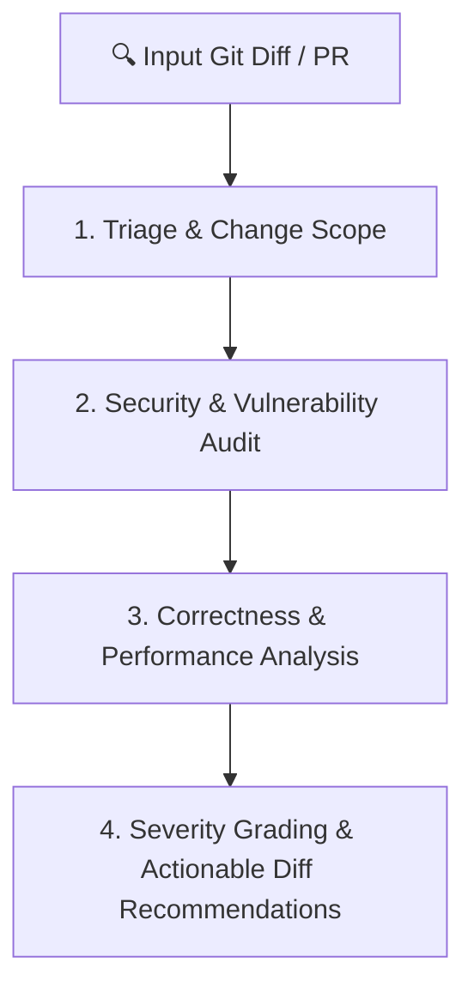

# Code Review Excellence

Transform code review into a rigorous quality gate and knowledge-sharing engine. Combines automated static analysis patterns (OWASP, Semgrep, CodeQL) with empathetic, actionable, severity-graded feedback.

---

## When to Use This Skill

- Reviewing pull requests, feature branches, or commits
- Performing pre-merge code quality, security, and performance audits
- Mentoring developers and establishing engineering team standards
- User asks to "review this PR", "review my code", "audit diff"

## Do Not Use This Skill

- Writing production feature code from scratch
- Pure design discussions without code diffs
- Simple spelling fixes or trivial single-line renames

---

## The 4-Tier Review Pipeline



### Tier 1: Triage & Change Scope
1. **Analyze Diff Size**:
   - Small (`< 200` lines): Deep structural & behavioral review.
   - Medium (`200 - 600` lines): Standard multi-tier review.
   - Large (`> 600` lines): Flag PR for decomposition if possible; review public APIs and high-risk paths first.
2. **Classify Intent**: Bug fix, feature addition, refactoring, performance patch, or breaking change.
3. **Verify Context**: Check PR against the original spec or issue requirements.

### Tier 2: Security & Vulnerability Audit
Scan diff for high-risk security flaws:
- **Injection Flaws**: SQL injection, command injection, XSS, SSRF, template injection.
- **Authentication & Authorization**: Insecure direct object references (IDOR), missing role checks, broken session state.
- **Secrets & Credentials**: Hardcoded API keys, JWT secrets, database connection strings, tokens.
- **Data Privacy**: PII leakage in structured logs, unencrypted sensitive fields.
- **Dependency & Supply Chain**: Vulnerable packages, unpinned dependencies.

### Tier 3: Correctness, Architecture & Performance
- **Logical Bugs**: Off-by-one errors, unhandled `null`/`undefined`, unhandled error cases, broken promise rejections.
- **Concurrency & State**: Race conditions, deadlocks, state pollution, unsafe shared mutable state.
- **Performance & Database**:
  - N+1 query patterns and missing database indexes
  - Memory leaks (unclosed sockets, listeners, file handles)
  - Unbounded memory accumulation in loops or caches
- **Clean Architecture**: Separation of concerns, domain model integrity, interface abstraction, violation of DRY or SOLID.

### Tier 4: Severity-Graded Feedback

Always format review feedback with standardized severity tags so developers know what blocks merge versus what is advice:

| Severity Tag | Meaning | Merge Policy |
|:-------------|:--------|:-------------|
| 🔴 **`[BLOCKING]`** | Critical correctness bug, security vulnerability, data loss, breaking API change. | Must fix before merge. |
| 🟡 **`[IMPORTANT]`** | Performance bottleneck, missing edge case, lack of test coverage, significant tech debt. | Strongly recommended fix. |
| 🟢 **`[SUGGESTION]`** | Code style, readability, naming improvement, idiomatic refinement. | Author discretion. |
| ❓ **`[QUESTION]`** | Clarification on architectural intent, trade-offs, or assumptions. | Requires discussion. |

---

## Actionable Feedback Format

Every review comment must include:
1. **File and Line Range**: Exact location of the issue.
2. **Issue Severity & Explanation**: Why this is an issue and what happens if left unfixed.
3. **Concrete Diff Solution**: Before/after code block showing the recommended fix.

```markdown
### 🔴 [BLOCKING] SQL Injection Vulnerability in User Search
- **Location**: `src/services/userService.ts#L42-L46`
- **Rationale**: User input `searchTerm` is concatenated directly into raw SQL query without parameterization.
- **Recommended Fix**:
```diff
- const query = `SELECT * FROM users WHERE name = '${searchTerm}'`;
+ const query = 'SELECT * FROM users WHERE name = $1';
+ const result = await db.query(query, [searchTerm]);
```
```

---

## Pre-Merge Review Checklist

- [ ] All new logic is covered by automated unit/integration tests
- [ ] No regression in existing test suite
- [ ] No secrets, keys, or sensitive credentials in git diff
- [ ] Error handling covers edge cases, timeouts, and network failures
- [ ] Database queries are parameterized and indexed
- [ ] Changes adhere to project brand guidelines and tech stack

---

## Resources

- See [`resources/implementation-playbook.md`](file:///resources/implementation-playbook.md) for domain-specific checklists (Frontend, Backend, Database, Cloud).
