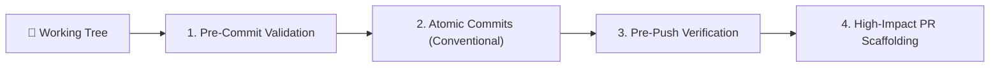

# Complete Git & PR Delivery Workflow

Orchestrate an end-to-end Git workflow from pre-commit validation through Conventional Commits and high-impact Pull Request creation.

---

## When to Use This Skill

- Preparing uncommitted changes for a clean Git commit
- Formatting commits according to Conventional Commits (`feat:`, `fix:`, `refactor:`, `test:`, `docs:`)
- Opening or enhancing a Pull Request with complete test evidence and context
- Ensuring pre-merge branch hygiene before pushing to remote

## Do Not Use This Skill

- For complex git surgery like recovering lost commits via reflog or interactive rebase (use `git-advanced-workflows`)
- Reviewing code without making commits or PRs (use `code-review-excellence`)

---

## The 4-Phase Delivery Pipeline



### Phase 1: Pre-Commit Validation & Triage
1. **Diff Hygiene**:
   - Check `git status` and `git diff`
   - Ensure no unintended temporary files, `.env` files, credentials, or debug logs are staged
   - Verify files changed match the intended scope
2. **Pre-commit Quality Checks**:
   - Run linter / type checker (e.g. `npm run lint`, `tsc --noEmit`, `flake8`, `cargo clippy`)
   - Run relevant unit tests to guarantee green status

### Phase 2: Atomic Commits & Conventional Standards
Stage and commit logical units independently:
- Format: `<type>(<optional scope>): <imperative subject>`
- Types:
  - `feat`: New feature or capability
  - `fix`: Bug fix
  - `refactor`: Code change that neither fixes a bug nor adds a feature
  - `test`: Adding or correcting tests
  - `docs`: Documentation only changes
  - `chore`: Build process, dependencies, or tool configurations
- Rule: One logical purpose per commit. Never bundle unrelated changes.

### Phase 3: Pre-Push Verification
1. Verify target branch is up-to-date (`git fetch origin`, rebase if needed).
2. Execute full automated test suite to ensure zero regressions.
3. Push to feature branch: `git push origin <branch-name>`.

### Phase 4: High-Impact Pull Request Generation
Generate a comprehensive, easy-to-review Pull Request:

```markdown
## Summary of Changes
- Concise 2-3 bullet explanation of what was built and why.
- Closes/Fixes #[issue-number]

## Type of Change
- [ ] 🚀 New feature
- [ ] 🐛 Bug fix
- [ ] ♻️ Refactoring
- [ ] ⚡ Performance improvement
- [ ] 📝 Documentation update

## Key Decisions & Architecture
- Highlight non-obvious design choices or trade-offs made.

## Verification & Test Evidence
- **Commands Run**: `npm test`, `npm run lint`
- **Results**: All 48 tests passed (0 failures, 100% green).
- **Screenshots / Logs**: [Insert terminal output or UI screenshot]

## Reviewer Checklist
- [ ] Public API contracts and interfaces are preserved or documented
- [ ] Error handling and edge cases verified
- [ ] No hardcoded secrets or credentials
```

---

## Resources

- See [`resources/implementation-playbook.md`](file:///resources/implementation-playbook.md) for PR templates, review checklists, and branch management strategies.
