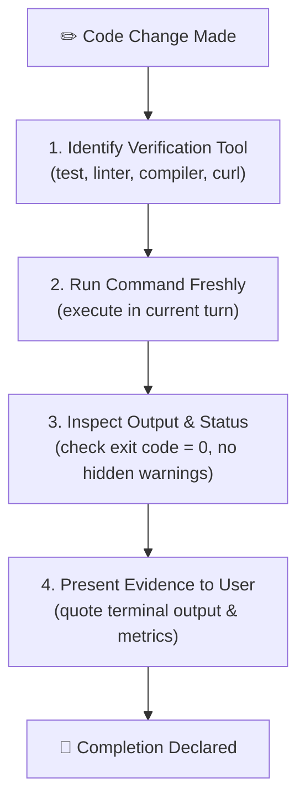

# Verifying Before Completion

Enforce an uncompromising evidence gate: **never claim that code works, tests pass, or bugs are fixed without fresh, objective proof in the current turn.**

---

## The Iron Law of Verification

> [!CAUTION]
> **No completion claim without fresh verification evidence.**
> - Never assume a fix worked because it looks correct.
> - Never say "tests should now pass" or "this should resolve the issue".
> - Never rely on stale execution results from previous turns.
> - Always run the test, build, or verification command and inspect the actual output before asserting success.

---

## When to Use This Skill

- Before stating a task, bug fix, or feature is complete
- Before creating a commit or opening a Pull Request
- After making edits to resolve test failures or syntax errors
- When validating build artifacts, schemas, or configurations

## Do Not Use This Skill

- During initial exploratory brainstorming (before any code is written)
- When answering pure conceptual questions that involve no code changes

---

## The 4-Step Verification Gate

### Step 1: Identify Verification Command
Select the highest-fidelity verification command available:
- **Unit / Regression Tests**: e.g., `npm test -- <test-file>`, `pytest tests/test_feature.py`, `cargo test`, `go test ./...`
- **Type Checking & Linting**: e.g., `npm run lint`, `npx tsc --noEmit`, `flake8`
- **Build / Packaging**: e.g., `npm run build`, `cargo build --release`
- **End-to-End / API**: e.g., executing the CLI directly, invoking an endpoint via curl

### Step 2: Run the Command Freshly
Execute the tool directly in the current session.
Do not assume that an edit made to a file "automatically succeeded" or that a lint error disappeared without rerunning the check.

### Step 3: Inspect Output & Status
1. **Verify Exit Code**: Ensure exit code is `0`.
2. **Scan for Hidden Failures**:
   - Check for skipped tests or unhandled promise rejections
   - Check for runtime warnings, memory leaks, or deprecations
   - Verify that all assertions in the test actually ran (not bypassed by early returns)

### Step 4: Present Evidence to User
When summarizing completion, provide the objective evidence:
- **Exact command executed**
- **Test summary**: e.g., `12 passed, 0 failed in 1.42s`
- **Key output**: snippet of terminal output demonstrating the passing test or green build

---

## Verification Anti-Patterns to Forbid

| Forbidden Behavior | Why It Is Dangerous | Required Standard |
|:-------------------|:--------------------|:------------------|
| **"This should fix it"** | Speculation without proof; frequently wrong. | Run the verification command first. Then say: *"Verified: [command] passed with [result]."* |
| **Claiming pass without running test** | Model hallucination; breaks trust. | Always call `run_command` or test tool before writing the summary. |
| **Ignoring secondary errors** | Fixing test A while breaking test B. | Run the full package suite or regression suite before sign-off. |
| **Muting assertions to pass** | Faking green tests by removing checks. | Fix the underlying code; preserve and strengthen assertions. |
