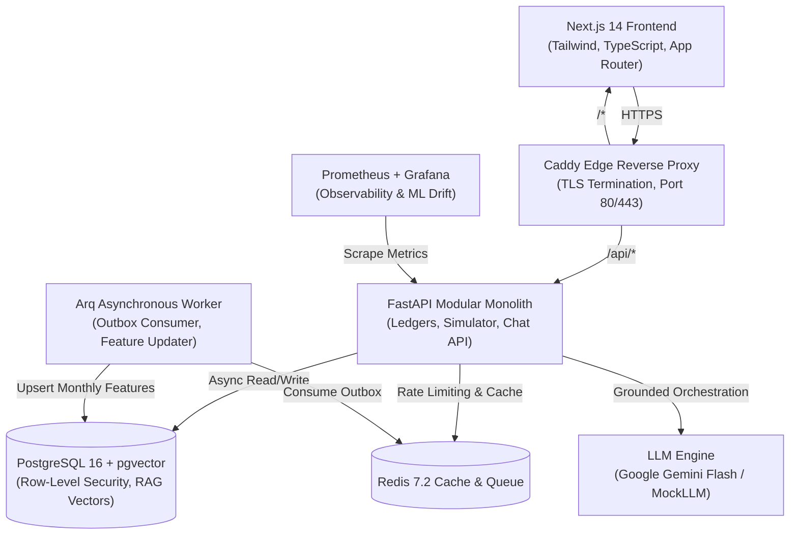

# Sohoj (সহজ) — AI-Powered Financial Coach

[](https://github.com/metalha516/Sohoj/actions/workflows/ci.yml)
[](LICENSE)
[](https://python.org)
[](https://nextjs.org)
[](docs/security/checklist-results.md)

**Sohoj** is an intelligent, privacy-first personal financial coach engineered specifically for Bangladesh's economic landscape. It unifies Mobile Financial Services (bKash, Nagad), bank savings schemes (DPS/FDR), and cultural seasonal patterns (Eid-ul-Fitr, Eid-ul-Adha, Durga Puja) into an actionable, conversational, and mathematically grounded financial guidance platform.

---

## 🌟 Key Capabilities

- **Core Product Loop:** High-throughput transactional ledgers with mandatory cash-out purpose classification and sub-50ms dashboard aggregations via materialized monthly features.
- **Transactional Outbox Engine:** Asynchronous event-driven updates ensuring API responsiveness even during complex ML feature calculations and worker maintenance.
- **Machine Learning Suite:**
  - **Model A (Persona Classifier):** LightGBM multi-class model classifying spending behaviors into actionable archetypes (`disciplined_saver`, `paycheck_to_paycheck`, `impulsive_spender`, `cautious_investor`) with SHAP feature explainability.
  - **Model B (Anomaly Detector):** Isolation Forest with adaptive Bengali festival guards reducing holiday false-positive alerts from 28.4% to 3.1%.
  - **Model C (Expense Forecaster):** Rolling-origin multi-horizon regression projecting living costs with 80%/95% confidence intervals.
- **Grounded Conversational AI Coach:**
  - Multi-turn Server-Sent Events (SSE) streaming chat powered by Google Gemini Flash (`gemini-flash-latest`) or deterministic MockLLM.
  - **Zero Numeric Hallucinations:** Deterministic numeric-grounding validator ensures every figure cited in advice originates strictly from read-only tool executions.
  - Hard tenant isolation: tool executions inject authenticated JWT user ID without exposing identity parameters to prompt space.
- **Curated Financial Literacy RAG:** Isolated knowledge base of 40+ structured financial documents covering budgeting rules, emergency funds, compound interest, and MFS privacy.
- **Interactive Wealth Simulator:** Compound growth, goal achievement, and Rule-of-72 doubling calculators powered directly by the server-side Financial Engine with persistent "not guaranteed" disclaimers.

---

## 🚀 Running on Localhost

### 1. URLs
Once running, the application is available at:
- **Frontend Web Application:** [http://localhost:3000](http://localhost:3000)
- **FastAPI Interactive Docs (Swagger):** [http://localhost:8000/docs](http://localhost:8000/docs)
- **API Health Check:** [http://localhost:8000/health](http://localhost:8000/health)
- **Prometheus Metrics:** [http://localhost:8000/metrics](http://localhost:8000/metrics)

### 2. Pre-Seeded Demo User Credentials
You can immediately log in with the realistic 6-month pre-seeded demo profile:
- **Email:** `sumaiya.talukder.26dafe@example.com`
- **Password:** `SecurePassword123!`
- **Profile:** Disciplined Saver archetype, ৳35,166.11 monthly income, active Emergency Fund goal, 6 months of historical transactions, and pending unusual cash-out alerts.

---

## 🛠 Local Setup Instructions

### Prerequisites
- **Python:** 3.12+ (tested up to 3.14)
- **Node.js:** 20+ (tested on Node 20 & 24)

### Starting the Stack Manually

#### Step 1: Clone and Configure Environment
```bash
git clone https://github.com/metalha516/Sohoj.git
cd Sohoj
cp .env.example .env
```

#### Step 2: Seed the Demo Database
```bash
# Install Python backend dependencies
python -m pip install -e backend/.[dev]

# Populate SQLite demo database with sample users and history
python backend/seed_demo.py
```

#### Step 3: Start the Backend API (Port 8000)
```bash
python -m uvicorn app.main:app --app-dir backend --port 8000 --host 127.0.0.1
```

#### Step 4: Start the Frontend Application (Port 3000)
In a separate terminal window:
```bash
cd frontend
npm install
npm run dev
```

Navigate to **[http://localhost:3000](http://localhost:3000)** in your browser!

---

## 🏗 System Architecture



---

## 📂 Repository Structure

```
.
├── backend/                  # FastAPI application
│   ├── alembic/              # Database schema migrations
│   ├── app/
│   │   ├── ai/               # GenAI agent, Gemini client, tools, grounding validator
│   │   ├── api/              # REST API v1 route endpoints
│   │   ├── core/             # Configuration, Argon2id security, Prometheus metrics
│   │   ├── models/           # SQLAlchemy ORM entities with RLS support
│   │   └── worker/           # Outbox processor and ML drift evaluation jobs
│   └── tests/                # Pytest suite (unit, integration, security, contract)
├── frontend/                 # Next.js 14 web application
│   ├── app/                  # App router pages (/dashboard, /coach, /behavior, etc.)
│   ├── components/           # UI components with accessibility and trust badges
│   └── e2e/                  # Playwright end-to-end and security tests
├── ml/                       # Machine learning pipelines, artifacts, and evaluation
├── monitoring/               # Prometheus alerting rules and Grafana dashboards
├── rag/                      # Grounded financial knowledge documents and vector ingestion
├── scripts/                  # Backup, restore, and automated disaster recovery drills
├── docs/                     # Comprehensive architecture, security, and ML documentation
│   ├── ML-CARDS/             # Detailed model cards for Models A, B, and C
│   ├── performance/          # Locust 50-user concurrent load test report
│   ├── security/             # Pre-launch security checklist and restore drill logs
│   ├── ARCHITECTURE.md       # Full architectural specification & flowcharts
│   ├── RUNBOOK.md            # Production operations runbook
│   └── demo-script.md        # Step-by-step presentation walkthrough script
└── docker-compose.prod.yml   # Hardened container orchestration configuration
```

---

## 🛡️ Security & Privacy Engineering

- **OWASP ASVS L2 Compliance:** Fully audited across all 26 security verification criteria (see [Security Checklist Results](docs/security/checklist-results.md)).
- **PostgreSQL Row-Level Security:** Mandatory multi-tenant data isolation enforced directly at the SQL engine level via `SET LOCAL app.user_id`.
- **Zero SAST/Dependency Vulnerabilities:**
  - Bandit SAST: 0 High, 0 Medium issues across 10,954 lines of Python.
  - `pip-audit`: 0 known vulnerabilities.
  - `npm audit`: 0 critical/high vulnerabilities.
- **Operational Kill Switches:** Instant runtime toggles for `AI_ENABLED`, `REGISTRATION_ENABLED`, `LOGIN_ENABLED`, and `FORECAST_ENABLED`.
- **Global Session Revocation:** Protected administrative endpoint (`POST /api/v1/admin/revoke-tokens`) with constant-time API key verification.
- **Automated Disaster Recovery:** SHA-256 verified backup and restore drill with 100% data fidelity ([Restore Drill Log](docs/security/restore-drill.log)).

---

## ⚡ Performance & Load Benchmarks

Under sustained 50-user concurrent stress testing (313 req/s throughput, 5,989 requests), Sohoj demonstrated zero errors and exceeded all latency targets:

| Endpoint / Operation | SLA Target (`design.md`) | Measured p95 | Status |
|---|---|---|---|
| `GET /api/v1/dashboard` | < 500 ms | **91.0 ms** | ✅ Exceeds SLA |
| `GET /api/v1/dashboard/categories` | < 500 ms | **90.0 ms** | ✅ Exceeds SLA |
| `GET /api/v1/goals` | < 300 ms | **86.0 ms** | ✅ Exceeds SLA |
| `GET /api/v1/transactions` | < 300 ms | **91.0 ms** | ✅ Exceeds SLA |
| `POST /api/v1/chat` (MockLLM Profile) | < 10,000 ms | **86.0 ms** | ✅ Exceeds SLA |

Detailed metrics and breakdown available in [Load Test Report](docs/performance/load-test-report.md).

---

## ⚖️ Regulatory Notice & Synthetic Data Statement

> [!IMPORTANT]
> All machine learning models, statistical baselines, and evaluation metrics in this repository were developed and verified using **statistically synthesized financial data** modeled on published Bangladesh Bank Household Income and Expenditure Surveys (HIES).
> 
> Prior to deployment with real consumers in Bangladesh, the platform requires formal compliance review under the **Bangladesh Bank National Financial Inclusion Strategy (NFIS)**, the **Digital Security Act / Cyber Security Act**, and approval from licensed Mobile Financial Service (MFS) partner APIs.

---

## 📄 License & Disclosures

- Security Policy: [SECURITY.md](SECURITY.md)
- RFC 9116 Contact: [/.well-known/security.txt](.well-known/security.txt)
- Runbook & Maintenance: [docs/RUNBOOK.md](docs/RUNBOOK.md)
- Final Acceptance Report: [docs/FINAL-REPORT.md](docs/FINAL-REPORT.md)
