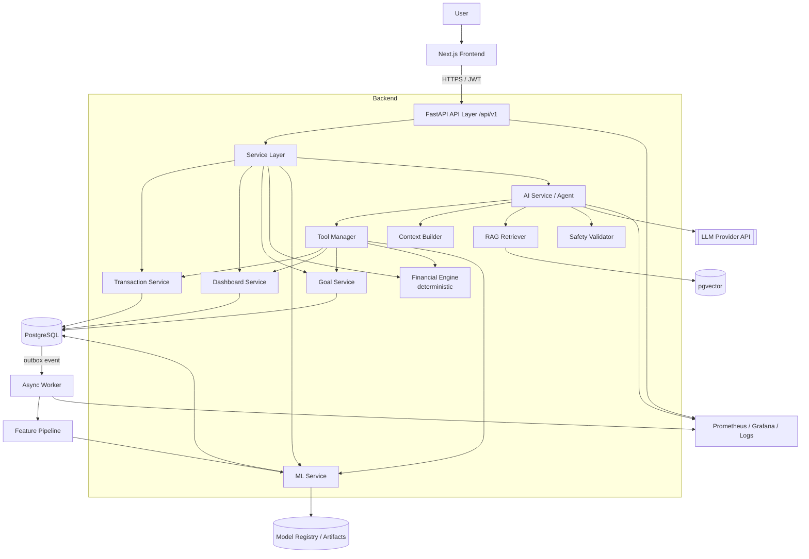
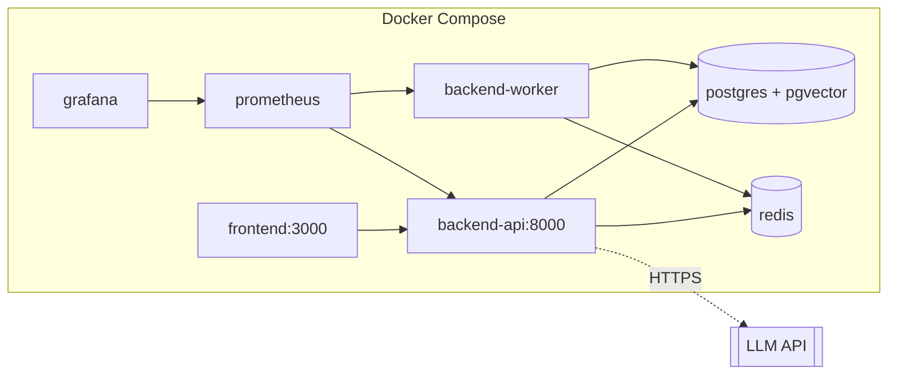
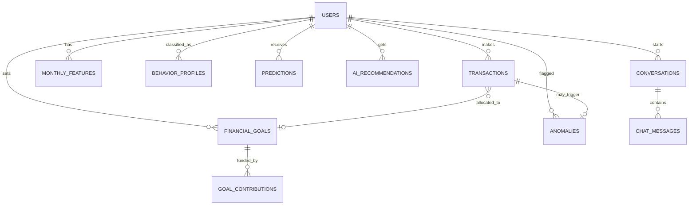
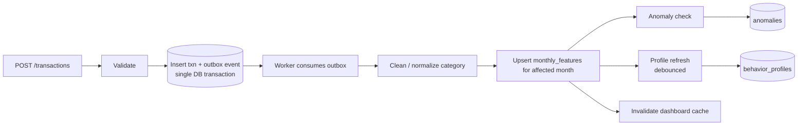
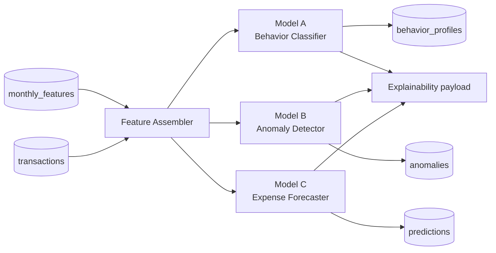
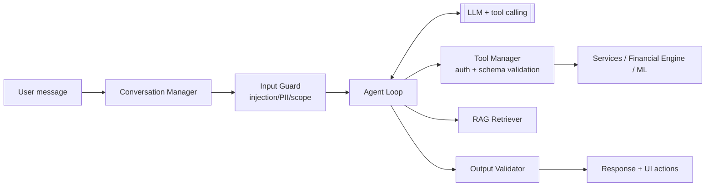
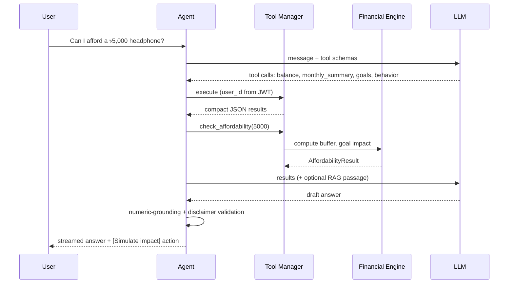
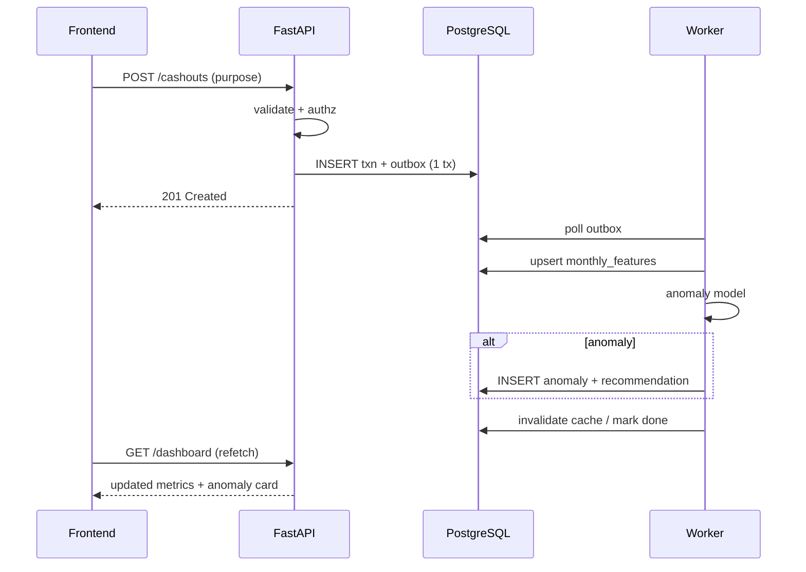

# AI Financial Coach for MFS Users — System Design

| | |
|---|---|
| **Status** | Draft v1.0 |
| **Scope** | MVP (Phases 1–10) with hooks for Version 2 |
| **Source** | Project Master Context |
| **Currency** | BDT (৳), stored as `NUMERIC(14,2)` |

---

## 1. Overview

### 1.1 Purpose
AI Financial Coach turns raw MFS (Mobile Financial Services) transactions into **information → behavior → prediction → simulation → explanation → personalized coaching**. It is *not* a chatbot with financial opinions; it is an analytics platform whose conversational layer is grounded in controlled data and deterministic calculation.

### 1.2 Guiding Principles (design constraints)
| # | Principle | Architectural consequence |
|---|---|---|
| P1 | The LLM is not a source of truth | LLM never does arithmetic or reads DB directly |
| P2 | PostgreSQL is the truth for user data | All user facts come via service-layer tools |
| P3 | Financial Engine is the truth for math | Pure, deterministic, unit-tested Python module with no LLM/DB dependency |
| P4 | ML gives predictions, not facts | Every ML output carries confidence + model version |
| P5 | RAG gives knowledge, not user data | Vector store holds only public/educational content |
| P6 | Minimum data to the LLM | A **Context Builder** produces compact aggregates, never raw transaction dumps |
| P7 | Never present projections as guarantees | Response validator enforces assumption/disclaimer labelling |

### 1.3 Goals / Non-Goals
**Goals:** accurate dashboards, behavior classification, anomaly detection, goal planning, growth simulation, grounded conversational coaching, secure handling of financial data.

**Non-Goals (MVP):** executing money movement, investment advice on specific securities, real MFS-provider integration, Bangla/voice (Future), deep-learning forecasting.

---

## 2. Requirements

### 2.1 Functional
| ID | Requirement |
|---|---|
| FR-1 | Register/login/refresh with JWT |
| FR-2 | Record transactions; cash-out requires a *purpose* (Necessity / Savings-Goal / Discretionary / Other) with optional sub-category |
| FR-3 | Dashboard: balance, income, expense, savings, savings rate, spend mix, goals, forecast, profile, anomalies, insights |
| FR-4 | Behavior profile classification with confidence and top contributing factors |
| FR-5 | Anomaly detection on new transactions and monthly category spend |
| FR-6 | Expense forecast with uncertainty interval (V2 in UI; model built in Phase 3) |
| FR-7 | Financial goals with progress, required monthly saving, ETA, feasibility vs. history |
| FR-8 | Growth / doubling / goal / what-if simulators |
| FR-9 | Conversational coach with tool calling, RAG, history |
| FR-10 | Synthetic data generator + CSV/Parquet export for ML |

### 2.2 Non-Functional
| Category | Target (MVP) |
|---|---|
| Latency | CRUD p95 < 300 ms; dashboard p95 < 500 ms; chat first token < 3 s, full answer p95 < 10 s |
| Freshness | Anomaly + feature update visible within ~5 s of a transaction (async) |
| Availability | 99.5% (single region, containerized) |
| Scale (design target) | 10k users, 100k–1M transactions, ~50 concurrent chats |
| Security | OWASP ASVS L2 baseline; encryption in transit and at rest; audit log |
| Privacy | Data minimization; PII never sent to LLM; per-user isolation |
| Testability | Financial Engine ≥ 95% coverage; tool contracts tested; ML regression gates |

---

## 3. Architecture

### 3.1 Logical View



### 3.2 Layered Code Structure
```
API (routers, schemas)  →  Services (business logic)  →  Repositories (SQLAlchemy)  →  PostgreSQL
                                   ↘ Financial Engine (pure functions)
                                   ↘ ML inference (loaded model artifacts)
                                   ↘ AI (agent, tools, prompts, safety, rag)
```
Rules:
- Routers contain **no** business logic.
- The Financial Engine imports nothing from DB, ML, or AI packages.
- AI tools call **services**, never repositories or raw SQL.
- Every service method takes an explicit `user_id` taken from the authenticated principal — never from LLM output.

### 3.3 Deployment View (MVP)


- **Reverse proxy** (Caddy/Nginx/Traefik) terminates TLS in front of both frontend and API.
- **Redis** serves three roles: task queue broker (Celery/Arq), rate-limit counters, short-lived cache (dashboard aggregates).
- **Worker** runs feature updates, ML inference, nightly batch jobs.

---

## 4. Data Layer

### 4.1 Conceptual Model



### 4.2 Schema (PostgreSQL DDL)

> Improvements over the master context: money uses `NUMERIC`, enums are constrained, goal contributions are explicit, anomalies/features/chat are first-class tables, and every table is user-scoped for isolation.

```sql
CREATE EXTENSION IF NOT EXISTS "pgcrypto";
CREATE EXTENSION IF NOT EXISTS vector;

CREATE TYPE txn_type    AS ENUM ('income','expense','cash_in','cash_out','transfer');
CREATE TYPE purpose_t   AS ENUM ('necessity','savings_goal','discretionary','other');
CREATE TYPE goal_status AS ENUM ('active','achieved','paused','cancelled');

CREATE TABLE users (
    id             UUID PRIMARY KEY DEFAULT gen_random_uuid(),
    name           TEXT NOT NULL,
    email          CITEXT UNIQUE NOT NULL,
    password_hash  TEXT NOT NULL,                 -- argon2id
    monthly_income NUMERIC(14,2) CHECK (monthly_income >= 0),
    consent_ai     BOOLEAN NOT NULL DEFAULT FALSE, -- consent to send aggregates to LLM
    created_at     TIMESTAMPTZ NOT NULL DEFAULT now(),
    updated_at     TIMESTAMPTZ NOT NULL DEFAULT now()
);

CREATE TABLE transactions (
    id               UUID PRIMARY KEY DEFAULT gen_random_uuid(),
    user_id          UUID NOT NULL REFERENCES users(id) ON DELETE CASCADE,
    amount           NUMERIC(14,2) NOT NULL CHECK (amount > 0),
    transaction_type txn_type NOT NULL,
    purpose          purpose_t,                     -- required when cash_out/expense
    category         TEXT,                          -- e.g. food, transport, shopping
    merchant         TEXT,
    description      TEXT,
    goal_id          UUID REFERENCES financial_goals(id),
    idempotency_key  TEXT,
    ts               TIMESTAMPTZ NOT NULL,          -- when it happened
    created_at       TIMESTAMPTZ NOT NULL DEFAULT now(),
    CONSTRAINT purpose_required CHECK (
        transaction_type NOT IN ('expense','cash_out') OR purpose IS NOT NULL),
    UNIQUE (user_id, idempotency_key)
);
CREATE INDEX idx_txn_user_ts       ON transactions (user_id, ts DESC);
CREATE INDEX idx_txn_user_cat_ts   ON transactions (user_id, category, ts DESC);

CREATE TABLE financial_goals (
    id             UUID PRIMARY KEY DEFAULT gen_random_uuid(),
    user_id        UUID NOT NULL REFERENCES users(id) ON DELETE CASCADE,
    name           TEXT NOT NULL,
    target_amount  NUMERIC(14,2) NOT NULL CHECK (target_amount > 0),
    current_amount NUMERIC(14,2) NOT NULL DEFAULT 0,
    target_date    DATE,
    status         goal_status NOT NULL DEFAULT 'active',
    created_at     TIMESTAMPTZ NOT NULL DEFAULT now(),
    updated_at     TIMESTAMPTZ NOT NULL DEFAULT now()
);

-- Pre-aggregated monthly facts: the main input for dashboard, ML, and LLM context
CREATE TABLE monthly_features (
    user_id              UUID NOT NULL REFERENCES users(id) ON DELETE CASCADE,
    month                DATE NOT NULL,                      -- first day of month
    income               NUMERIC(14,2) NOT NULL DEFAULT 0,
    expense              NUMERIC(14,2) NOT NULL DEFAULT 0,
    savings              NUMERIC(14,2) NOT NULL DEFAULT 0,
    savings_rate         NUMERIC(6,4),
    necessity_expense    NUMERIC(14,2) NOT NULL DEFAULT 0,
    discretionary_expense NUMERIC(14,2) NOT NULL DEFAULT 0,
    necessity_rate       NUMERIC(6,4),
    discretionary_rate   NUMERIC(6,4),
    txn_count            INT NOT NULL DEFAULT 0,
    cashout_count        INT NOT NULL DEFAULT 0,
    avg_txn              NUMERIC(14,2),
    median_txn           NUMERIC(14,2),
    expense_variance     NUMERIC(18,4),
    spending_growth      NUMERIC(8,4),                       -- vs. previous month
    income_expense_ratio NUMERIC(8,4),
    savings_consistency  NUMERIC(6,4),                       -- rolling window
    category_breakdown   JSONB NOT NULL DEFAULT '{}',        -- {"food": 5200.00, ...}
    computed_at          TIMESTAMPTZ NOT NULL DEFAULT now(),
    PRIMARY KEY (user_id, month)
);

CREATE TABLE behavior_profiles (
    id                 UUID PRIMARY KEY DEFAULT gen_random_uuid(),
    user_id            UUID NOT NULL REFERENCES users(id) ON DELETE CASCADE,
    profile            TEXT NOT NULL,
    confidence         NUMERIC(5,4) NOT NULL,
    top_factors        JSONB NOT NULL,                       -- explainability payload
    savings_rate       NUMERIC(6,4),
    necessity_rate     NUMERIC(6,4),
    discretionary_rate NUMERIC(6,4),
    cashout_frequency  NUMERIC(8,4),
    spending_variance  NUMERIC(18,4),
    model_version      TEXT NOT NULL,
    as_of_month        DATE NOT NULL,
    created_at         TIMESTAMPTZ NOT NULL DEFAULT now()
);

CREATE TABLE anomalies (
    id               UUID PRIMARY KEY DEFAULT gen_random_uuid(),
    user_id          UUID NOT NULL REFERENCES users(id) ON DELETE CASCADE,
    transaction_id   UUID REFERENCES transactions(id) ON DELETE SET NULL,
    scope            TEXT NOT NULL CHECK (scope IN ('transaction','category_month')),
    category         TEXT,
    anomaly_score    NUMERIC(5,4) NOT NULL,
    observed_value   NUMERIC(14,2) NOT NULL,
    baseline_value   NUMERIC(14,2) NOT NULL,
    deviation_pct    NUMERIC(8,2) NOT NULL,
    explanation      JSONB NOT NULL,
    model_version    TEXT NOT NULL,
    status           TEXT NOT NULL DEFAULT 'open' CHECK (status IN ('open','dismissed','confirmed')),
    created_at       TIMESTAMPTZ NOT NULL DEFAULT now()
);

CREATE TABLE predictions (
    id               UUID PRIMARY KEY DEFAULT gen_random_uuid(),
    user_id          UUID NOT NULL REFERENCES users(id) ON DELETE CASCADE,
    prediction_type  TEXT NOT NULL CHECK (prediction_type IN
                       ('expense_forecast','savings_forecast','anomaly','behavior')),
    prediction_value JSONB NOT NULL,        -- {"point":30800,"lower":28200,"upper":33400}
    confidence       NUMERIC(5,4),
    horizon_month    DATE,
    model_version    TEXT NOT NULL,
    prediction_date  TIMESTAMPTZ NOT NULL DEFAULT now(),
    created_at       TIMESTAMPTZ NOT NULL DEFAULT now()
);

CREATE TABLE ai_recommendations (
    id         UUID PRIMARY KEY DEFAULT gen_random_uuid(),
    user_id    UUID NOT NULL REFERENCES users(id) ON DELETE CASCADE,
    type       TEXT NOT NULL,
    title      TEXT NOT NULL,
    content    TEXT NOT NULL,
    priority   SMALLINT NOT NULL DEFAULT 3,
    source_refs JSONB,                     -- which facts/predictions produced this
    created_at TIMESTAMPTZ NOT NULL DEFAULT now()
);

CREATE TABLE conversations (
    id         UUID PRIMARY KEY DEFAULT gen_random_uuid(),
    user_id    UUID NOT NULL REFERENCES users(id) ON DELETE CASCADE,
    title      TEXT,
    created_at TIMESTAMPTZ NOT NULL DEFAULT now()
);
CREATE TABLE chat_messages (
    id              UUID PRIMARY KEY DEFAULT gen_random_uuid(),
    conversation_id UUID NOT NULL REFERENCES conversations(id) ON DELETE CASCADE,
    role            TEXT NOT NULL CHECK (role IN ('user','assistant','tool')),
    content         TEXT NOT NULL,
    tool_calls      JSONB,
    tokens_in       INT, tokens_out INT, latency_ms INT,
    feedback        SMALLINT,               -- -1 / 0 / +1
    created_at      TIMESTAMPTZ NOT NULL DEFAULT now()
);

CREATE TABLE audit_log (
    id         BIGSERIAL PRIMARY KEY,
    user_id    UUID, actor TEXT NOT NULL, action TEXT NOT NULL,
    resource   TEXT, ip INET, metadata JSONB,
    created_at TIMESTAMPTZ NOT NULL DEFAULT now()
);

CREATE TABLE outbox_events (            -- reliable async trigger for the ML pipeline
    id           BIGSERIAL PRIMARY KEY,
    aggregate_id UUID NOT NULL, event_type TEXT NOT NULL, payload JSONB NOT NULL,
    created_at   TIMESTAMPTZ NOT NULL DEFAULT now(), processed_at TIMESTAMPTZ
);

CREATE TABLE rag_chunks (
    id        BIGSERIAL PRIMARY KEY,
    doc_id    TEXT NOT NULL, source TEXT NOT NULL, title TEXT,
    chunk     TEXT NOT NULL, embedding vector(1536), metadata JSONB
);
CREATE INDEX idx_rag_embedding ON rag_chunks USING hnsw (embedding vector_cosine_ops);
```

### 4.3 Key Data Definitions (resolve ambiguities early)

| Concept | Definition |
|---|---|
| **Income** | Sum of `income` transactions in month |
| **Expense** | Sum of `expense` + `cash_out` where `purpose ≠ savings_goal` |
| **Savings** | `cash_out`/`transfer` with `purpose = savings_goal` **plus** `income − expense − savings_goal` residual is *not* auto-counted; savings is explicit contributions. Dashboard also shows *unallocated surplus* = `income − expense − savings` |
| **Savings rate** | `savings / income` (null if income = 0) |
| **Transfers** | Excluded from income/expense unless tagged to a goal; internal transfers must not double count |
| **Balance** | Cached running balance = Σ(income + cash_in) − Σ(expense + cash_out + outbound transfer); reconciled nightly |
| **Month boundary** | `Asia/Dhaka` timezone |

> ⚠️ Decide and document the savings definition before generating synthetic data, otherwise ML labels and dashboard numbers will disagree.

### 4.4 Data Pipeline



- **Transactional outbox** guarantees ML/feature updates are never lost if the worker is down.
- **Incremental aggregation**: only the affected `(user, month)` row is recomputed.
- **Debouncing**: profile/forecast refresh at most once per N minutes per user, plus a nightly full batch.
- **Idempotency**: client sends `Idempotency-Key`; unique constraint prevents duplicate transactions on retry.

### 4.5 Synthetic Data Generator

```
data/synthetic/generator.py
  ├─ persona configs (6 archetypes → parameter distributions)
  ├─ income model: lognormal by archetype, salary-day clustering
  ├─ spend model: category mix ~ Dirichlet(persona prior) × seasonality (Eid, Pohela Boishakh, etc.)
  ├─ cash-out model: Poisson count × lognormal amount
  ├─ injected anomalies: ~2–3% spikes, labelled `is_injected_anomaly`
  └─ outputs: PostgreSQL bulk insert + Parquet/CSV in data/exports/
```
Design cautions:
- Persona label comes from the **generator persona**, but add overlap (noisy/mixed users, drifting personas) so the classifier isn't trivially separable.
- Keep a **held-out generator seed** for test data; never tune on it.
- Report results on synthetic data as *pipeline validation*, not real-world accuracy.

---

## 5. ML Layer

### 5.1 Overview



Three **specialized** models, each behind a common interface:

```python
class MLModel(Protocol):
    name: str
    version: str
    def predict(self, features: FeatureFrame) -> Prediction: ...
    def explain(self, features: FeatureFrame) -> Explanation: ...
```

### 5.2 Model A — Behavior Classification
| Item | Design |
|---|---|
| Task | Multiclass: 6 profiles |
| Input | 3-month rolling window of `savings_rate, necessity_rate, discretionary_rate, income_expense_ratio, cashout_frequency, avg_txn, expense_variance, spending_growth, savings_consistency` |
| Baseline | **Rule-based classifier** (thresholds) — serves as fallback and sanity check |
| Models | Logistic Regression → Random Forest → LightGBM/XGBoost (compare) |
| Output | `{profile, confidence, top_factors[{feature, value, direction}]}` |
| Explainability | SHAP (tree) or permutation importance; mapped to human labels ("Savings rate: high") |
| Cold start | < 2 months of data → return `"insufficient_data"` and rule-based preliminary profile with low confidence |
| Gate | Macro-F1 ≥ baseline + margin on held-out; calibrated probabilities (`CalibratedClassifierCV`) so "confidence" is meaningful |

Language rule: profile names are descriptive, never moral ("Consistent Saver", not "Good user").

### 5.3 Model B — Anomaly Detection
Two complementary detectors:

| Level | Method | Baseline |
|---|---|---|
| Single transaction | Robust z-score (median/MAD) per `(user, category)`; fallback to peer-group stats when user history < 10 txns | user's category history |
| Category-month | Isolation Forest over `[amount, category share, txn_count, day_of_month, deviation vs. 3-month avg]`; LOF as alternative | rolling 3–6 months |

Output includes interpretable fields — `observed`, `baseline`, `deviation_pct` — so the LLM never has to guess *why* it was flagged.
- Anomaly ≠ bad: wording is "unusual vs. your pattern."
- User feedback (`dismissed/confirmed`) is stored for later threshold tuning.
- Metrics: precision, recall, FPR on injected anomalies; alert budget (e.g., ≤ 3 alerts/user/month) to prevent fatigue.

### 5.4 Model C — Expense Forecasting
| Item | Design |
|---|---|
| Target | Next month total expense (and optionally per category) |
| Features | Lags 1–3, rolling mean/std, income, txn_count, month-of-year, discretionary share |
| Ladder | Naive/moving average → Ridge/Linear → Random Forest/LightGBM → Holt-Winters/Prophet (only if data supports) |
| Data reality | Per-user history is short (6–12 pts). Prefer a **global model** across users with user-level features, plus a per-user moving-average fallback |
| Uncertainty | Quantile regression (LightGBM `objective=quantile` at 0.1/0.5/0.9) or conformal intervals |
| Metrics | MAE, RMSE, MAPE (guard against near-zero denominators; also report sMAPE) |
| Validation | Time-based split (no shuffling); rolling-origin evaluation |

### 5.5 Training, Registry, Serving
```
ml/
  preprocessing/  features/  training/  evaluation/  models/
```
- **Experiment tracking**: MLflow (or lightweight JSON + git tag).
- **Artifacts**: `models/{name}/{version}/model.joblib + metadata.json` (training data hash, metrics, feature list/schema, git SHA).
- **Promotion**: new version is *shadow-evaluated* against current on recent data; promote only if metrics gates pass.
- **Serving**: in-process inference in the worker/API (models are small; no separate model server needed in MVP). Loaded once at startup, hot-reloadable by version pointer.
- **Feature contract**: a typed `FeatureSchema` shared by training and serving prevents training/serving skew.
- **Retraining**: monthly scheduled + on drift alert.

---

## 6. Financial Engine

Deterministic, pure Python, **zero dependency on LLM/DB/ML**. Uses `decimal.Decimal` for money, validated inputs, and explicit return dataclasses that include the **assumptions** used.

### 6.1 API
```python
# backend/app/financial/engine.py
calculate_future_value(principal, annual_rate, years, monthly_contribution=0,
                       compounding_per_year=12, contribution_timing="end") -> FVResult
calculate_doubling_time(annual_rate, compounding_per_year=1) -> DoublingResult
calculate_monthly_required_saving(target, current, months, annual_rate=0) -> RequiredSavingResult
calculate_goal_progress(target, current, target_date, today) -> GoalProgress
calculate_savings_rate(income, savings) -> Decimal | None
calculate_expense_ratio(income, expense) -> Decimal | None
calculate_emergency_fund(avg_monthly_essentials, months_target=3..6, current_fund) -> EmergencyFundResult
run_scenario(base: ScenarioInput, overrides: dict) -> ScenarioResult   # incl. yearly series for charts
calculate_affordability(balance, upcoming_commitments, avg_monthly_surplus, amount, goals_impact) -> AffordabilityResult
```

### 6.2 Formulas
- **Future value (lump sum):** `A = P·(1 + r/n)^(n·t)`
- **With monthly contributions (m = periodic deposit, i = r/12, N = 12t, end-of-month):**
  `FV = P·(1+i)^N + m·[((1+i)^N − 1)/i]`  (and `i = 0` ⇒ `FV = P + m·N`)
- **Doubling time (annual compounding):** `t = ln 2 / ln(1+r)`; for `n`-times compounding: `t = ln 2 / (n·ln(1 + r/n))`
- **Required monthly saving (no return):** `(target − current) / months`; with return solve the annuity formula for `m`
- **Goal ETA:** months = `ln(...)` closed form with contributions, or `ceil(remaining / avg_monthly_saving)` when rate = 0

### 6.3 Result Contract (assumption transparency)
```json
{
  "future_value": 1034567.89,
  "total_contributed": 800000.00,
  "total_growth": 234567.89,
  "assumptions": {
    "rate_type": "assumed",          // assumed | historical | contractual
    "annual_rate": 0.08,
    "compounding_per_year": 12,
    "inflation_adjusted": false
  },
  "series": [{"year": 1, "balance": 123456.78}],
  "disclaimer_code": "PROJECTION_NOT_GUARANTEED"
}
```
`rate_type` is mandatory so the safety layer can label outputs correctly (Assumed / Historical / Contractual).

### 6.4 Testing
Property-based (Hypothesis): monotonicity in rate/time, FV ≥ contributions when r ≥ 0, `rate=0` special cases, rounding rules (banker's vs. half-up — choose one), large values, negative/zero inputs raise typed errors.

---

## 7. GenAI Layer

### 7.1 Components


### 7.2 Agent Loop
1. **Load context**: last N turns (summarized if long), user locale, consent flag.
2. **LLM call #1** with system prompt + tool schemas → emits tool calls or direct answer.
3. **Tool Manager** executes calls: injects `user_id` from the JWT (never from model args), validates args against JSON Schema, enforces per-request tool budget (e.g., ≤ 6 calls, 1 round-trip depth ≤ 3), timeouts, returns **compact structured JSON**.
4. Optional **RAG** retrieval when the question is conceptual or a definition/explanation is needed.
5. **LLM call #2** composes the final answer from tool results only.
6. **Output Validator** (see 7.5).
7. Persist message, tool trace, token usage; stream response (SSE) to the UI.

### 7.3 Tool Registry

| Tool | Backed by | Returns (compact) |
|---|---|---|
| `get_user_profile` | UserService | income band, goals count (no email/name) |
| `get_current_balance` | TransactionService | balance, as_of |
| `get_transactions` | TransactionService | filtered, **capped** (≤ 50) rows, or aggregated by category/date |
| `get_monthly_summary` | DashboardService | metrics for month(s) + MoM deltas |
| `get_behavior_profile` | MLService | profile, confidence, top_factors, model_version |
| `get_spending_forecast` | MLService | point + interval, horizon, model_version |
| `get_anomalies` | MLService | open anomalies with observed/baseline/deviation |
| `get_financial_goals` | GoalService | goals + progress |
| `calculate_future_value` | Financial Engine | FVResult |
| `calculate_doubling_time` | Financial Engine | DoublingResult |
| `calculate_goal_plan` | Engine + history | required saving vs. historical saving, ETA, feasibility |
| `calculate_savings_rate` | Engine | rate |
| `run_financial_scenario` | Engine | scenario series |
| `check_affordability` *(added)* | Engine + summary | verdict inputs + remaining buffer |
| `search_knowledge` | RAG | top-k passages with source ids |

Tool definition example:
```json
{
  "name": "calculate_future_value",
  "description": "Exact compound growth calculation. Use for any 'how much will X become' question.",
  "input_schema": {
    "type": "object",
    "properties": {
      "principal": {"type": "number", "minimum": 0},
      "annual_rate_percent": {"type": "number", "minimum": 0, "maximum": 100},
      "years": {"type": "number", "exclusiveMinimum": 0, "maximum": 60},
      "monthly_contribution": {"type": "number", "minimum": 0, "default": 0},
      "compounding_per_year": {"type": "integer", "enum": [1,2,4,12,365], "default": 12},
      "rate_type": {"type": "string", "enum": ["assumed","historical","contractual"]}
    },
    "required": ["principal","annual_rate_percent","years","rate_type"]
  }
}
```
Missing required parameters → the agent **asks the user** rather than guessing (Safety Principle 10).

### 7.4 Context Builder (minimum-necessary data)
Tools return **summaries**. A typical payload is a few hundred tokens:
```json
{
  "period": "2026-09",
  "income": 40000, "expense": 29000, "savings_rate": 0.275,
  "mom_expense_change": 0.18,
  "top_increase": {"category": "shopping", "change_pct": 0.32},
  "profile": {"label": "Balanced Spending", "confidence": 0.84},
  "open_anomalies": 1
}
```
Rules: no names/emails/phone numbers/merchant account IDs; raw transactions only on explicit request and capped; amounts bucketed where possible; per-request data manifest logged for audit.

### 7.5 Safety & Validation

| Stage | Check |
|---|---|
| **Input** | Prompt-injection heuristics; scope check (finance-related); PII redaction before logging; length limits |
| **Tool** | Auth principal injected server-side; schema validation; read-only tools in MVP; rate limits |
| **Output — numeric grounding** | Every number in the answer must appear in tool outputs (or be a trivial derivation). Validator extracts numbers/percentages and checks against the tool-result set; mismatch ⇒ regenerate once, else fall back to a templated answer |
| **Output — labelling** | Projections must include assumption + "not guaranteed" language; ML outputs must be phrased as estimates with confidence |
| **Output — advice boundary** | No specific securities, no "you should definitely"; planning/educational framing; escalate to disclaimer for loans/investments/tax/legal |
| **Fallback** | LLM/tool failure ⇒ graceful message + link to dashboard; never fabricate |

### 7.6 Prompt System
```
prompts/
  system.md           # role, principles, tone, refusal rules, formatting
  tools_policy.md     # when to call which tool, ask-for-missing-info rule
  response_style.md   # ৳ formatting, brevity, "estimate vs. actual" wording
  few_shots/          # affordability, goal, anomaly, growth, general-knowledge
```
Versioned in git; prompt version recorded with each chat message. A **golden conversation suite** (≈50–100 cases) runs in CI against a mocked or real LLM to catch regressions (tool selection, numeric faithfulness, refusals).

### 7.7 Example Flow — "Can I afford a ৳5,000 headphone?"


---

## 8. RAG Design

| Stage | MVP choice |
|---|---|
| Sources | Curated financial-literacy docs, budgeting guides, glossary, app/MFS FAQs, internal rules |
| Ingestion | Offline script (`rag/ingestion`): parse → clean → chunk (300–500 tokens, 10–15% overlap, heading-aware) → embed → upsert into `rag_chunks` |
| Store | **pgvector** (one fewer system; transactional with the rest) — FAISS only if scale demands |
| Retrieval | Top-k = 4 by cosine similarity + metadata filter (`topic`, `language`); optional BM25 hybrid later |
| Prompting | Retrieved passages are inserted as *quoted reference material* with source ids; the model must cite and may not treat them as user data |
| Boundary | **No user transactions or PII in the vector store** |
| Quality | Offline eval set (question → expected source); metrics: hit@k, answer groundedness; log retrieval scores and "no-result" rate |
| Framework | Start with plain Python + pgvector (thin wrapper). Adopt LlamaIndex/LangChain only if you need their loaders/evals — avoids heavy abstraction early |

When to retrieve: conceptual questions ("what is an emergency fund?"), terminology, app documentation. Skip RAG when the question is purely about user data or calculation.

---

## 9. API Layer

**Base:** `/api/v1` · JSON · `Authorization: Bearer <access_token>` · OpenAPI auto-docs.

### 9.1 Endpoints
| Area | Endpoint | Notes |
|---|---|---|
| Auth | `POST /auth/register`, `/auth/login`, `/auth/refresh`, `/auth/logout` | Access 15 min, refresh 7 d, rotation + revocation list |
| Users | `GET/PATCH /users/me`, `DELETE /users/me` | Delete = data erasure workflow |
| Transactions | `POST /transactions` · `GET /transactions?from&to&type&category&cursor` · `GET/DELETE /transactions/{id}` | Cursor pagination, idempotency key |
| Cash-outs | `POST /cashouts`, `GET /cashouts` | Purpose mandatory |
| Dashboard | `GET /dashboard`, `/dashboard/monthly?months=6`, `/dashboard/categories?month=` | Cached 30–60 s, invalidated on write |
| Behavior | `GET /behavior/profile`, `/behavior/insights` | Includes `top_factors` |
| Anomalies *(added)* | `GET /anomalies`, `PATCH /anomalies/{id}` (dismiss/confirm) | Feedback loop |
| Forecast | `GET /forecast/expenses`, `/forecast/savings` | Interval + model_version |
| Goals | `POST/GET /goals`, `GET/PATCH/DELETE /goals/{id}`, `POST /goals/{id}/contributions` | Plan computed on read |
| Simulation | `POST /simulate/growth`, `/simulate/goal`, `/simulate/doubling`, `/simulate/scenario` | Stateless, engine only |
| AI | `POST /chat` (SSE stream), `GET /chat/history`, `POST /chat/{id}/feedback` | |
| Ops | `GET /health`, `/ready`, `/metrics` | `/metrics` internal-only |

### 9.2 Representative Contracts
```http
POST /api/v1/cashouts
Idempotency-Key: 7f3a...
{ "amount": 2500.00, "purpose": "necessity", "category": "transportation",
  "merchant": null, "description": "Monthly pass", "timestamp": "2026-10-03T09:15:00+06:00" }
→ 201 { "id": "…", "anomaly": null, "dashboard_stale": true }
```
```http
POST /api/v1/simulate/growth
{ "principal": 20000, "monthly_contribution": 5000, "annual_rate_percent": 8,
  "years": 5, "compounding_per_year": 12, "rate_type": "assumed" }
→ 200 { "future_value": 392140.55, "total_contributed": 320000, "total_growth": 72140.55,
        "assumptions": {…}, "series": […], "disclaimer": "Projection based on an assumed rate; not guaranteed." }
```
```http
POST /api/v1/chat      (Accept: text/event-stream)
{ "conversation_id": "…|null", "message": "Why did my spending increase?" }
→ events: token | tool_status | ui_action | done {message_id, usage}
```

### 9.3 Conventions
- **Errors**: RFC 7807 problem+json with stable `code` (`VALIDATION_ERROR`, `RATE_LIMITED`, `INSUFFICIENT_DATA`…).
- **Versioning**: URL (`/v1`); additive changes only within a version.
- **Validation**: Pydantic v2 schemas; positive amounts, max bounds, enum purposes.
- **Rate limits** (Redis, per-user/IP): auth 5/min, chat 20/min + daily token budget, others 120/min.
- **Authorization**: every query filtered by `user_id` from token; row-level security (Postgres RLS) as defense in depth.

### 9.4 Backend Package Layout
```
backend/app/
  main.py  config.py  deps.py
  api/        auth.py transactions.py cashouts.py dashboard.py behavior.py goals.py forecast.py simulate.py chat.py
  schemas/    pydantic request/response models
  models/     SQLAlchemy ORM
  repositories/
  services/   transaction_service.py dashboard_service.py goal_service.py ml_service.py ai_service.py
  financial/  engine.py types.py
  ai/         agent.py tools/ prompts/ safety/ context_builder.py
  rag/        retriever.py
  ml/         inference.py registry.py schema.py
  workers/    tasks.py outbox.py scheduler.py
  core/       security.py logging.py errors.py metrics.py
```

---

## 10. Frontend

**Stack:** Next.js (App Router), React, TypeScript, Tailwind CSS, Recharts. Data fetching with TanStack Query; typed API client generated from OpenAPI.

### 10.1 Routes → Components
| Route | Key components |
|---|---|
| `/login`, `/register` | AuthForm |
| `/dashboard` | BalanceCard, IncomeCard, ExpenseCard, SavingsCard, SavingsRateChart, ExpenseCategoryChart, MonthlyExpenseChart, BehaviorProfileCard, FinancialGoalCard, ForecastCard, AnomalyCard, AIInsightCard |
| `/transactions` | TransactionTable (infinite scroll), AddTransactionDrawer, **CashOutPurposeModal** |
| `/behavior` | ProfileDetail, FactorBars (explainability), TrendCharts |
| `/goals` | GoalList, GoalForm, GoalPlanCard (required vs. actual saving) |
| `/simulator` | SliderPanel (initial, monthly, rate 2–12%, years 1–15), GrowthChart, AssumptionBanner |
| `/coach` | ChatWindow, MessageBubble, ToolStatusChip, ActionButtons, FeedbackButtons |
| `/profile`, `/settings` | Profile form, consent toggles (AI usage), data export/delete |

### 10.2 Frontend Design Notes
- **Auth**: access token in memory; refresh token in `HttpOnly; Secure; SameSite=Lax` cookie; Next middleware protects routes.
- **Simulator** runs client-side debounced calls to `/simulate/*` (engine remains the single source of truth — no duplicated math in JS).
- **Chat** uses SSE streaming; `ui_action` events render buttons like "View spending breakdown" that deep-link to filtered pages.
- **Trust UX**: every projection displays an *Assumed rate* badge; ML outputs show confidence; empty/low-data states are explicit ("Need 2+ months of data").
- **Accessibility/i18n**: ৳ formatting via `Intl.NumberFormat('en-BD')`; string externalization from day one to ease future Bangla support; mobile-first layout (MFS users are mostly on phones).

---

## 11. Security

| Area | Control |
|---|---|
| Transport | HTTPS/TLS 1.2+, HSTS; internal traffic on private Docker network |
| AuthN | Argon2id password hashing; JWT (short-lived access, rotating refresh); brute-force lockout; optional TOTP 2FA (V2) |
| AuthZ | Ownership checks in services; Postgres RLS (`user_id = current_setting('app.user_id')`) |
| Input | Pydantic validation; parameterized queries via SQLAlchemy (no string SQL) |
| Abuse | Redis rate limiting; per-user LLM token budgets; request size caps |
| Secrets | `.env` for local only; secret manager/Docker secrets in deploy; never in repo; `.env.example` has placeholders |
| Data at rest | Disk/DB encryption; field-level encryption for sensitive free-text (`description`, `merchant`) optional; backups encrypted |
| Audit | `audit_log` for login, data export/delete, goal changes, admin actions; append-only |
| LLM-specific | Prompt-injection defense (tool results and RAG text treated as untrusted data); tools are read-only; model cannot choose `user_id`; output validated before display |
| Supply chain | Dependency pinning, `pip-audit`/`npm audit`, container image scanning in CI |
| Logging | Structured logs, **no raw amounts/PII in app logs**; separate access to prompt/response traces |

### 11.1 Privacy
- **Data minimization**: collect only fields above; `monthly_income` optional (can be derived from income transactions).
- **Consent**: explicit opt-in (`consent_ai`) before any aggregates are sent to the external LLM; coach disabled otherwise.
- **Separation**: identity (`users`) is decoupled from financial/ML tables via UUIDs; the AI context and ML feature tables contain no direct identifiers.
- **LLM vendor**: use a provider/plan with no-training-on-data and appropriate retention terms; document data flows.
- **User rights**: export (JSON/CSV) and delete (hard delete + cascade + vector/chat purge) endpoints; retention policy for chat logs (e.g., 90 days).
- **Compliance note**: review Bangladesh data-protection regulation and any MFS provider/Bangladesh Bank requirements before handling real data.

---

## 12. Monitoring & Observability

### 12.1 Stack
Prometheus (metrics) + Grafana (dashboards/alerts) + structured JSON logs (+ Loki optional) + OpenTelemetry traces (API → worker → LLM) + Sentry for error tracking.

### 12.2 Metrics

| Category | Metrics | Alert example |
|---|---|---|
| **Application** | request rate, error rate, p50/p95/p99 latency by route, DB query time, pool usage, queue depth, worker lag, CPU/mem | 5xx > 2% for 5 min; outbox lag > 60 s |
| **ML** | inference latency, prediction distribution, **feature drift** (PSI/KS vs. training), prediction drift, forecast MAE/MAPE once actuals arrive, anomaly alert rate, anomaly dismiss rate (proxy for FPR), per-profile mix | PSI > 0.2 on key feature; MAPE +X% over baseline |
| **GenAI** | latency (TTFT/total), tokens in/out and cost per user, tool-call count/failures, validator rejection rate, fallback rate, RAG hit rate/score, thumbs up/down, refusal rate | validator rejects > 5%; tool failure > 3% |
| **Business** | DAU, chat sessions, goals created, cash-out purpose completion rate | — |

### 12.3 Feedback Loops
Ground-truth capture: actual next-month expense → forecast error; anomaly dismissals → threshold tuning; chat feedback + failed validations → prompt/golden-set additions.

---

## 13. Testing Strategy

| Layer | Approach |
|---|---|
| Financial Engine | Unit + property-based tests, golden numeric fixtures (cross-checked against spreadsheet) |
| Services/API | Pytest + Testcontainers Postgres; contract tests from OpenAPI; authz tests (user A cannot read user B) |
| Data pipeline | Idempotency, month-boundary/timezone, transfer double-count, late-arriving txn tests |
| ML | Data schema checks, metric gates on held-out synthetic set, invariance tests (e.g., scaling income & expense equally shouldn't change profile), drift simulation |
| AI | Golden conversation suite; **numeric-faithfulness** test (all answer numbers ⊆ tool outputs); prompt-injection corpus; tool-schema fuzzing |
| Frontend | Component tests (Vitest/RTL), Playwright E2E for auth → add txn → dashboard → coach |
| Security | SAST, dependency scan, basic DAST/ZAP, secrets scan |
| Load | k6/Locust on dashboard and chat endpoints |

---

## 14. Deployment & Environments

- **Environments**: `local` (docker-compose) → `staging` → `prod`.
- **Containers**: `frontend`, `backend-api`, `backend-worker`, `postgres(pgvector)`, `redis`, `prometheus`, `grafana`, reverse proxy.
- **CI/CD** (GitHub Actions): lint (ruff, mypy, eslint) → tests → image build → vulnerability scan → deploy to staging → smoke tests → manual promote.
- **Migrations**: Alembic; backward-compatible (expand → migrate → contract).
- **Config**: 12-factor env vars; feature flags (`AI_ENABLED`, `FORECAST_ENABLED`).
- **Backups**: daily PG dump + WAL archiving (PITR), tested restores; model artifacts versioned in object storage.
- **Scaling path**: API horizontal replicas behind proxy → separate worker pools (ML vs. general) → PG read replica for dashboards → managed vector DB only if pgvector becomes a bottleneck.

---

## 15. Key Cross-Cutting Flows

### 15.1 Transaction Ingest → Insight


### 15.2 Goal Planning
`POST /goals` → GoalService stores goal → Engine computes remaining, % progress, required monthly saving → compare with trailing 3-month average savings (from `monthly_features`) → feasibility label (*on track / stretch / unrealistic at current pace*) → coach can propose "reduce discretionary by ৳X" via `run_scenario`.

---

## 16. Failure Modes & Mitigations

| Risk | Mitigation |
|---|---|
| LLM hallucinated number | Tool-only numbers + numeric grounding validator + templated fallback |
| LLM provider outage/latency | Timeouts, retry w/ backoff, circuit breaker; dashboard/simulator work without the LLM |
| Worker down | Outbox retains events; API stays up; dashboard falls back to on-demand aggregation |
| Sparse user history | `INSUFFICIENT_DATA` states, rule-based fallbacks, wider uncertainty bands |
| Synthetic-data overfitting (inflated accuracy) | Noisy/overlapping personas, held-out seeds, plan to re-validate on real/pilot data |
| Model drift / seasonality (e.g., Eid) | Seasonality features, drift monitors, scheduled retraining |
| Anomaly alert fatigue | Per-user alert budget, severity thresholds, dismiss feedback |
| Prompt injection via merchant/description text | Treat all user-entered text as data; strip/escape in context; never place raw descriptions in system prompt |
| Double counting transfers/savings | Explicit transaction semantics (§4.3) + reconciliation tests |
| Regulatory/consent gaps | Consent gating, data-flow documentation, legal review pre-launch |

---

## 17. Implementation Roadmap (mapped to MVP)

| Phase | Deliverable | Exit criteria |
|---|---|---|
| 1 Foundation | Schema + Alembic, synthetic generator, bulk load | 10k users / 100k+ txns loaded; data-definition doc agreed |
| 2 Data | EDA notebook, feature pipeline → `monthly_features` | Features reproducible; schema versioned |
| 3 ML | Models A/B/C + registry + eval report | Beat rule/naive baselines; metrics gated |
| 4 Financial Engine | Module + tests | ≥95% coverage; golden fixtures pass |
| 5 GenAI | Agent, tools, prompts, validator | Golden suite passes; numeric-faithfulness ≥ 99% |
| 6 RAG | Corpus, ingestion, retrieval | hit@4 target on eval set |
| 7 API | All endpoints, auth, rate limiting | Contract + authz tests green |
| 8 Frontend | Pages + components + chat UI | E2E happy paths pass |
| 9 Monitoring | Dashboards + alerts | Alerts fire in staged failure drills |
| 10 Deployment | Compose/CI-CD/staging | One-command deploy; restore drill done |

**MVP cut:** Auth, transactions + purpose capture, dashboard, savings rate, behavior ML, anomaly detection, calculator, goals, coach, basic RAG, basic monitoring. **V2:** forecasting UI, what-if simulator UI, emergency-fund planner, notifications, impulse detection, monthly report, challenges.

---

## 18. Open Questions / Decisions Needed

1. **Savings definition & transfer semantics** (§4.3) — must be fixed before data generation.
2. **LLM provider and data-retention terms** — determines consent copy and region constraints.
3. **Real data access** — any pilot data from an MFS partner? Drives validation plan.
4. **Task queue choice** — Celery (mature) vs. Arq/RQ (lighter). Recommendation: Arq for MVP.
5. **Interest assumptions UX** — provide curated presets (e.g., savings account vs. DPS vs. custom) with clear "assumed" labelling?
6. **Language** — English-only MVP confirmed? (affects prompts, RAG corpus, number formatting).
7. **Retention policy** for chat logs and raw transactions.

---

## 19. Architecture Decision Records (summary)

| ADR | Decision | Rationale | Trade-off |
|---|---|---|---|
| 1 | Modular monolith (API + worker), not microservices | Small team, easier testing/deploy | Must keep module boundaries disciplined |
| 2 | PostgreSQL + pgvector for relational and vectors | Fewer moving parts, transactional | Less specialized than dedicated vector DB |
| 3 | Transactional outbox + async worker for ML | Reliable, decouples latency | Eventual consistency (seconds) |
| 4 | Pre-aggregated `monthly_features` | Fast dashboards, stable ML input, small LLM context | Needs recompute/backfill logic |
| 5 | In-process model serving | Simple; models are small | Revisit if models grow or need GPU |
| 6 | LLM tool-calling over direct DB/SQL generation | Safety, auth, determinism | More tool-definition work |
| 7 | Engine as pure module, mirrored via API for UI | Single source of math truth | Extra API calls from simulator UI |
| 8 | Rule-based baselines before ML | Honest benchmarking, graceful fallback | Slight extra effort |

---

*End of document.*
