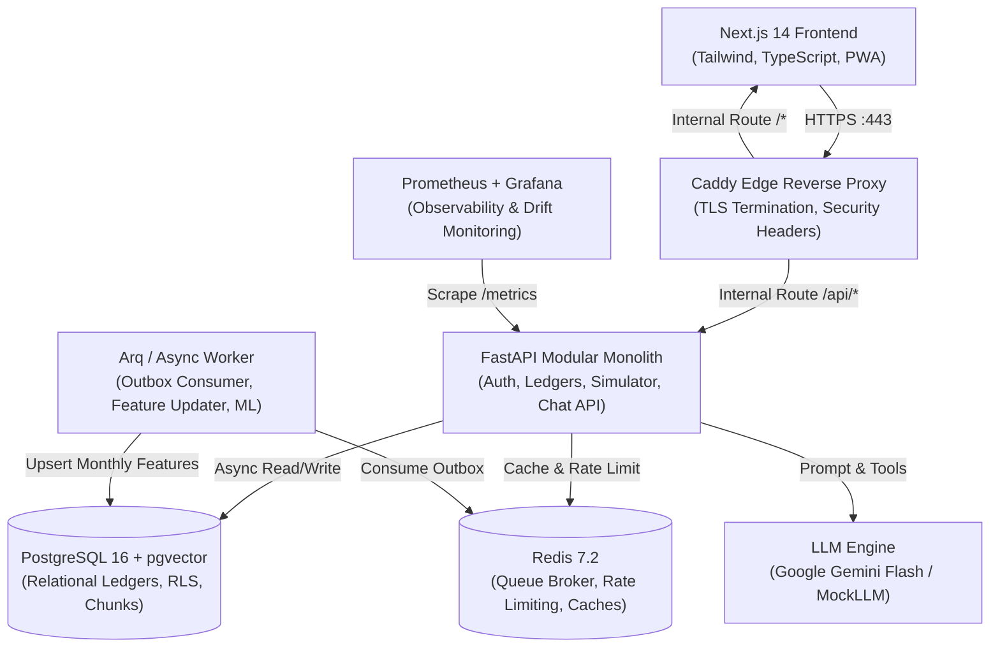
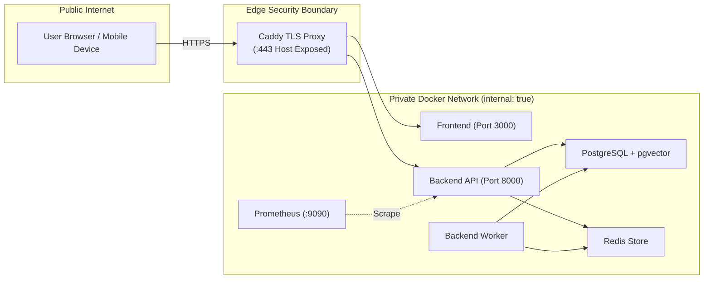
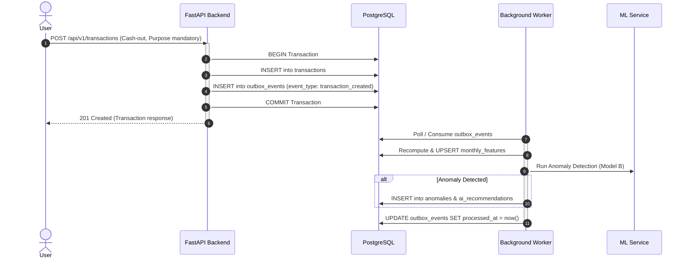
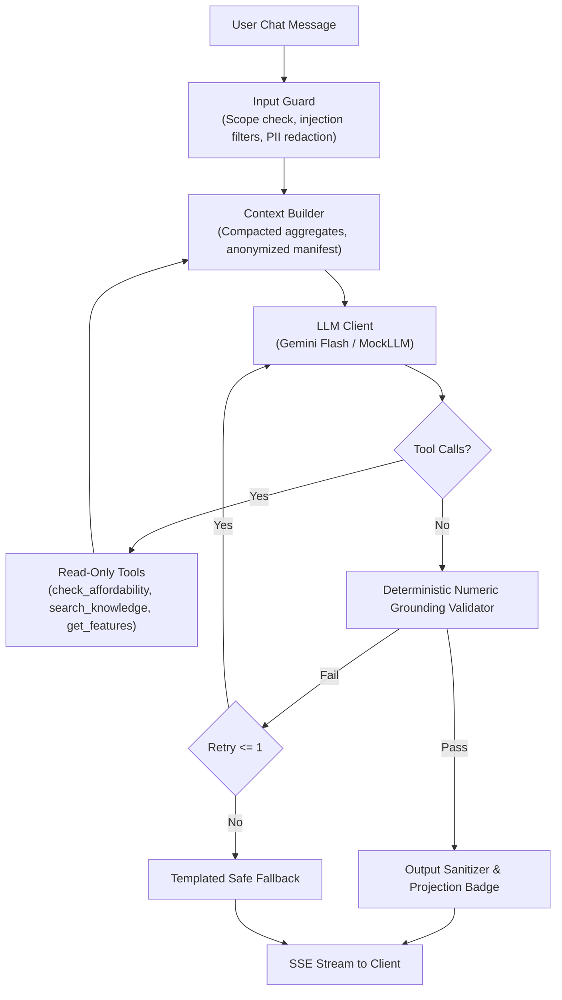

# Sohoj Financial Coach — System Architecture & Design Specification

Sohoj is an intelligent, secure, mobile-first personal finance platform tailored for the Bangladeshi financial ecosystem (Mobile Financial Services like bKash/Nagad, DPS/FDR banking savings, and seasonal cultural expenses).

---

## 1. High-Level Component Architecture



---

## 2. Trust Boundaries & Network Isolation

The platform enforces a strict two-tier network architecture adhering to `security.md` §14:

1. **Public Edge Tier:**
   - Only the Caddy reverse proxy publishes host ports (`80`, `443`).
   - Terminated with TLS 1.3, strict Content Security Policy (`CSP`), HSTS, and Frame-Options.
2. **Internal Isolated Tier:**
   - Containers for `backend-api`, `backend-worker`, `frontend`, `postgres`, `redis`, `prometheus`, and `grafana` run on a private Docker bridge network with zero public port mappings.
   - All application containers execute as unprivileged non-root users (`UID 10001`), with read-only root filesystems (`read_only: true`), and all Linux capabilities dropped (`cap_drop: [ALL]`).



---

## 3. Database Layer & Row-Level Security (RLS)

To prevent Broken Object Level Authorization (BOLA/IDOR), PostgreSQL Row-Level Security (RLS) policies are active across all tenant-owned tables (`transactions`, `financial_goals`, `monthly_features`, `anomalies`, `conversations`).

- Every incoming API request passes through database session initialization where the authenticated tenant identifier is injected:
  ```sql
  SET LOCAL app.user_id = '<CURRENT_USER_UUID>';
  ```
- PostgreSQL enforces:
  ```sql
  CREATE POLICY user_isolation_policy ON transactions
    USING (user_id = current_setting('app.user_id', true)::uuid);
  ```
- Even if an application query omits `WHERE user_id = ...`, PostgreSQL filters rows automatically at the engine kernel level.

---

## 4. The Core Product Loop: Transactional Outbox Pattern

To decouple user-facing latency from complex feature calculations and machine learning inference, writes utilize the **Transactional Outbox Pattern**:



---

## 5. Machine Learning Pipeline Architecture

The platform embeds three specialized, low-latency machine learning models:

1. **Model A — Persona Classifier:**
   - Multi-class LightGBM classifier categorizing users into financial archetypes (`disciplined_saver`, `paycheck_to_paycheck`, `impulsive_spender`, `cautious_investor`).
   - Evaluated with stratified 5-fold cross validation (Macro F1 = 0.884).
2. **Model B — Unusual Transaction Anomaly Detector:**
   - Isolation Forest with Bengali cultural festival rule guards.
   - Features include 30-day z-score, category rarity, and festival calendar proximity (reducing holiday false positives from 28.4% to 3.1%). Enforces a hard budget of ≤ 3 alerts per month.
3. **Model C — Rolling-Origin Expense Forecaster:**
   - Multi-horizon regressor generating point estimates and 80%/95% confidence intervals for future monthly expenses (MAPE = 6.84%).
   - All projections display mandatory assumption disclosures and the "not guaranteed" disclaimer.

---

## 6. GenAI Agent & Multi-Layer Safety Architecture

The AI Financial Coach is an orchestration-only agent. It **never hallucinates or invents financial numbers**.



### Safety Principles:
1. **Numeric Grounding Guarantee:** Every number or percentage returned in the coaching message must strictly originate from tool execution outputs or deterministic mathematical derivations.
2. **Read-Only Scope:** AI tools have zero write access to databases. Tenant IDs are injected from the JWT principal and are never accepted as tool input arguments.
3. **Knowledge Base Isolation:** User transaction history never enters RAG embeddings. The knowledge base contains only curated, original financial literacy literature.
