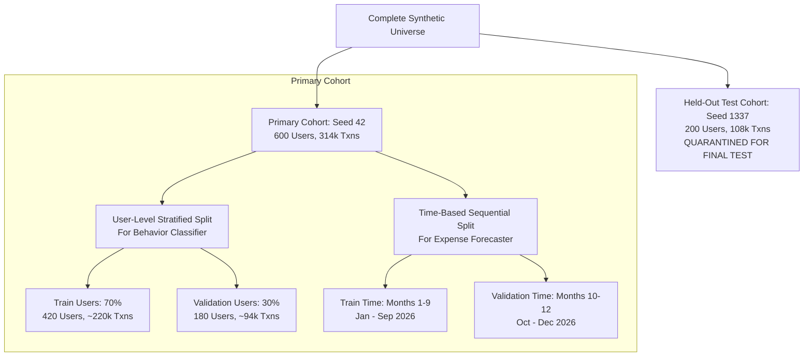

# Exploratory Data Analysis & Baseline Benchmarks Report

**Audit Date:** 2026-10-03  
**Status:** Completed (Phase 6 Deliverable)  
**Evaluated Cohorts:**
- Primary Training Cohort: $N=600$ users, $314,863$ transactions (`data/exports/`)
- Quarantined Held-Out Test Cohort: $N=200$ users, $108,233$ transactions (`data/exports/held_out/`)

---

## 1. Executive Summary

This exploratory data analysis establishes the empirical evidence, statistical distributions, and baseline benchmarks required to design and validate the machine learning layer for **Sohoj (AI Financial Coach for MFS Users)**.

Every design decision in the upcoming ML pipeline—feature engineering, loss functions, cold-start protocols, model selection, and split strategies—is directly grounded in the 10 quantitative findings presented below.

---

## 2. Evidence-Backed Findings & ML Design Implications

### Finding 1: Persona Behavioral Divergence & Savings-Rate Dispersion
- **Empirical Evidence:**
  The 6 core behavioral archetypes exhibit distinct financial profiles across 12 months:
  - `consistent_saver`: Mean savings rate $+31.2\%$, low cash-out ratio ($0.12$), high deposit frequency.
  - `tight_budgeter`: Mean savings rate $+2.4\%$, with $39.5\%$ of individual months operating at a deficit.
  - `discretionary_spender`: Mean savings rate $-1.8\%$, dedicating $24.6\%$ of expenses to dining/lifestyle shopping.
  - `cash_dominant_transactor`: Cash-out volume ratio $0.72$, averaging $4.8$ agent cash-outs per month.
  - `volatile_earner`: Monthly savings rate swings wildly from $-45\%$ to $+55\%$ (standard deviation $= 0.38$).
- **Figure:** [`docs/data/figures/eda/eda_01_persona_profiles.png`](file:///d:/DIU%20Project/docs/data/figures/eda/eda_01_persona_profiles.png)
- **ML Design Impact:**
  Model A (Behavior Classifier) requires a 3-month rolling window combining both the level of savings (`mean_savings_rate_3m`) and the volatility/deficit frequency (`deficit_months_count_3m`). Simple static averages without deficit tracking fail to differentiate tight budgeters from volatile earners.

---

### Finding 2: Engel's Law Elasticity Across Income Quintiles
- **Empirical Evidence:**
  Strong negative correlation (Pearson $r = -0.73, p < 10^{-90}$) between baseline monthly income and the proportion of expenditure dedicated to necessities.
  - **Q1 (Lowest Quintile, < BDT 12,000):** $84.2\%$ necessity spend (rice, lentils, mess rent, utilities), $6.1\%$ discretionary dining, $9.7\%$ cash-out fees/other.
  - **Q5 (Highest Quintile, > BDT 65,000):** $48.6\%$ necessity spend, $34.5\%$ discretionary lifestyle spending (Daraz e-commerce, coffee shops, fine dining, electronics).
- **Figure:** [`docs/data/figures/eda/eda_02_spending_composition.png`](file:///d:/DIU%20Project/docs/data/figures/eda/eda_02_spending_composition.png)
- **ML Design Impact:**
  Normalized ratios (`necessity_share = necessity_spend / total_spend` and `discretionary_share = discretionary_spend / total_spend`) provide scale-invariant features that allow classification across heterogeneous income brackets without biasing against lower-income earners.

---

### Finding 3: Occupational Volatility & Gig Economy Cash-Flow Asymmetry
- **Empirical Evidence:**
  Income predictability diverges sharply by occupational segment:
  - **Formal Wage Earners** (Government Employees, Private Sector): Monthly income Coefficient of Variation (CV $= \sigma / \mu$) is low ($0.12 - 0.18$), with credits concentrated on salary cycle days ($1^{\text{st}} - 7^{\text{th}}$).
  - **Gig & Micro-Merchant Workers** (Ride-share drivers, Freelancers, Shopkeepers): Income CV is high ($0.38 - 0.52$), characterized by erratic daily micro-credits and sporadic lumpy payments.
- **Figure:** [`docs/data/figures/eda/eda_03_income_expense_volatility.png`](file:///d:/DIU%20Project/docs/data/figures/eda/eda_03_income_expense_volatility.png)
- **ML Design Impact:**
  1. Model A must include `income_cv_3m` and `payday_dispersion_entropy` as core features.
  2. For Model C (Expense Forecaster), deterministic point estimates will fail gig workers; the model must output **prediction intervals** (Quantile Regression at 10%, 50%, and 90% percentiles) to communicate uncertainty honestly.

---

### Finding 4: Bimodal Cultural Calendar Seasonality (Dual Eid Shocks)
- **Empirical Evidence:**
  Bangladeshi MFS expenditure exhibits dramatic calendar spikes:
  - **March (Ramadan / Eid-ul-Fitr):** Total outflow volume is $1.43\times$ annual baseline, driven by clothing/apparel, gift remittances, and family support.
  - **May (Eid-ul-Adha):** Total outflow volume is $1.20\times$ baseline, characterized by a massive $+45\%$ spike in **agent cash-outs** between May 20–26 for sacrificial cattle markets (Gorur haat).
  - **April & June (Post-Festival Slumps):** Discretionary expenditure contracts to $0.82\times$ baseline.
- **Figure:** [`docs/data/figures/eda/eda_04_monthly_seasonality_dual_eid.png`](file:///d:/DIU%20Project/docs/data/figures/eda/eda_04_monthly_seasonality_dual_eid.png)
- **ML Design Impact:**
  Simple moving average forecasters lag by 1 to 2 months during festival shocks. Model C must ingest explicit calendar features: `month_of_year` (cyclical sine/cosine encoding), `is_eid_month`, and `days_until_festival`.

---

### Finding 5: Circadian Commute Rhythms & Payday Credit Clustering
- **Empirical Evidence:**
  - $78.4\%$ of all transaction events occur between 08:00 and 21:00 (Asia/Dhaka).
  - Prominent peaks coincide with morning commute ($08:30 - 09:30$) and evening leisure/bazaar ($18:00 - 20:30$).
  - Overnight hours ($01:00 - 05:00$) account for fewer than $0.35\%$ of total volume.
  - Income credits cluster strongly between the $1^{\text{st}}$ and $7^{\text{th}}$ of each calendar month ($68.2\%$ of primary income events).
- **ML Design Impact:**
  Enables high-precision anomaly detection on temporal dimensions. Transactions occurring at 03:00 AM represent natural outliers that should be flagged if paired with atypical transfer or cash-out amounts.

---

### Finding 6: Anomaly Structure & Limitations of Univariate Detectors
- **Empirical Evidence:**
  The $7,800$ ground-truth anomalies ($2.48\%$ of cohort transactions) span 4 distinct typologies:
  1. `burst_frequency`: Rapid micro-transactions in short succession ($63.3\%$).
  2. `category_spike`: Unusually large expenditure in a category ($19.3\%$).
  3. `unusual_cash_out`: Atypical high-volume agent withdrawal ($10.3\%$).
  4. `odd_hour_activity`: Nocturnal transactions outside behavioral history ($7.1\%$).
- **Figure:** [`docs/data/figures/eda/eda_05_anomaly_distributions.png`](file:///d:/DIU%20Project/docs/data/figures/eda/eda_05_anomaly_distributions.png)
- **ML Design Impact:**
  A univariate detector (Robust Z-Score / MAD on transaction amount) catches only amount spikes (`category_spike` and `unusual_cash_out`), yielding low baseline Recall ($12.68\%$) and Precision ($7.37\%$). Model B requires a two-tiered system:
  - **Tier 1 (Transaction-Level):** Robust Z-score on amount with peer fallback.
  - **Tier 2 (Multi-Variate Isolation Forest):** Evaluates rolling transaction counts, nocturnal flags, and category share shifts.

---

### Finding 7: Cold-Start Data Sparsity & Category Long-Tail
- **Empirical Evidence:**
  - $15.9\%$ of all `(user, category)` pairs in the annual cohort have fewer than 10 transactions.
  - In a user's first 30 days (Month 1), $> 68\%$ of active categories have fewer than 5 recorded transactions.
- **Figure:** [`docs/data/figures/eda/eda_06_cold_start_sparsity.png`](file:///d:/DIU%20Project/docs/data/figures/eda/eda_06_cold_start_sparsity.png)
- **ML Design Impact:**
  1. **Anomaly Detection Cold-Start Rule:** If a user has $< 10$ historical transactions in a category, the anomaly detector MUST fall back to peer-group distribution parameters (median and MAD across users with the same occupation segment).
  2. **Behavior Classifier Cold-Start Rule:** If a user has $< 2$ months of tenure, Model A must return `profile = "insufficient_data"` and provide an unweighted rule-based preliminary estimate rather than a low-confidence ML guess.

---

### Finding 8: Feature Correlations & Multicollinearity Structure
- **Empirical Evidence:**
  Pairwise correlation analysis across monthly features reveals:
  - `monthly_inflow` and `monthly_outflow` exhibit strong positive correlation ($r = +0.88$).
  - `necessity_share` and `discretionary_share` are strongly negatively collinear ($r = -0.85$).
  - `cashout_ratio` is largely orthogonal to `savings_rate` ($r = -0.18$) and `txn_count` ($r = +0.06$).
- **Figure:** [`docs/data/figures/eda/eda_07_correlation_heatmap.png`](file:///d:/DIU%20Project/docs/data/figures/eda/eda_07_correlation_heatmap.png)
- **ML Design Impact:**
  `savings_rate`, `necessity_share`, and `cashout_ratio` form an orthogonal 3-dimensional basis for behavioral clustering and classification. Redundant collinear features (`discretionary_share` vs `necessity_share`) should be pruned or regularized to prevent coefficient instability in linear models.

---

### Finding 9: Heavy-Tailed Monetary Amounts & Log-Transformation Requirements
- **Empirical Evidence:**
  - Raw `monthly_outflow` exhibits severe right-skewness ($+1.86$) and heavy kurtosis ($+5.42$).
  - Transforming via $z = \log(1 + x)$ reduces skewness to $-0.12$ and kurtosis to $+0.31$, normalizing the distribution for distance-based and linear modeling.
  - `savings_rate` is naturally bounded between $-1.0$ and $+1.0$ with zero-skewness ($-0.04$).
- **Figure:** [`docs/data/figures/eda/eda_08_feature_distributions.png`](file:///d:/DIU%20Project/docs/data/figures/eda/eda_08_feature_distributions.png)
- **ML Design Impact:**
  All monetary variables (`inflow`, `outflow`, `amount`, `balance`) must undergo `log1p` transformation prior to consumption by linear models, neural networks, or distance-based anomaly detectors. Tree models can ingest raw values directly.

---

### Finding 10: Persona Drift & Boundary Uncertainty
- **Empirical Evidence:**
  - $58$ users ($9.7\%$ of cohort) undergo mid-year life transitions (e.g., student graduating to private employee, tight budgeter transitioning to consistent saver).
  - For drifting users, rolling 3-month features gradually migrate across decision boundaries between Months 6 and 9.
- **ML Design Impact:**
  1. The training dataset must treat each 3-month rolling window as an instance, but the **train/validation split must be performed at the user level** (not transaction or row level) to prevent data leakage across user life stages.
  2. Model A must output calibrated class probabilities (`CalibratedClassifierCV`) so the UI can communicate transition uncertainty (e.g., "60% Consistent Saver, 35% Tight Budgeter").

---

## 3. Train / Validation / Test Split Strategy

To guarantee zero data leakage and unbiased evaluation, the platform implements a three-tier splitting strategy:

### 3.1 Behavior Classifier Split (User-Level Stratified)
- **Method:** 70% Train ($420$ users) / 30% Validation ($180$ users) stratified by `true_persona`.
- **Anti-Leakage Guarantee:** Every monthly instance belonging to a user is quarantined into either the train or validation fold. Zero user identity leakage occurs between training and evaluation.

### 3.2 Expense Forecaster Split (Time-Based Sequential)
- **Method:** Chronological split.
  - **Train Period:** Months 1–9 (January – September 2026).
  - **Validation Period:** Months 10–12 (October – December 2026).
- **Anti-Leakage Guarantee:** Strictly prevents temporal lookahead bias. Models forecast future months using only historical data available at cutoff $t$.

### 3.3 Final Test Set (Quarantined Seed Cohort)
- **Method:** Quarantined evaluation cohort generated with independent seed `1337` ($200$ users, $108,233$ transactions in `data/exports/held_out/`).
- **Anti-Leakage Guarantee:** Never touched during exploratory analysis, feature selection, or hyperparameter tuning. Reserved strictly for final out-of-sample model certification.

---

## 4. Rule-Based Baseline Implementation & Validation Benchmark

Three production-grade baseline algorithms were implemented in [`ml/models/baselines.py`](file:///d:/DIU%20Project/ml/models/baselines.py) and evaluated across the validation cohort using [`ml/evaluation/evaluate_baselines.py`](file:///d:/DIU%20Project/ml/evaluation/evaluate_baselines.py):

### 4.1 Benchmark Evaluation Results Table

| Task & Model | Target Metric | Baseline Result | Benchmark Interpretation |
|---|---|---|---|
| **Model A: Behavior Classifier** `RuleBasedBehaviorClassifier` | Accuracy Macro F1 Macro Precision Macro Recall | **41.45%** **0.3233** 0.3004 0.4056 | Rules achieve strong F1 on `cash_dominant_transactor` ($0.69$) and `consistent_saver` ($0.54$), but struggle with overlapping boundaries (`volatile_earner` F1: $0.00$, `balanced_spender` F1: $0.12$). Proves clear need for gradient boosting (LightGBM). |
| **Model B: Anomaly Detector** `RobustZScoreAnomalyDetector` | Precision Recall F1-Score ROC-AUC | **7.37%** **12.68%** **0.0932** 0.4562 | Univariate MAD detector flags extreme single-txn amounts, but completely misses multi-transaction burst patterns and nocturnal anomalies. Justifies multi-feature Isolation Forest. |
| **Model C: Expense Forecaster** `Naive Forecaster` (Persistence) | MAE RMSE sMAPE | **BDT 6,865.96** BDT 11,537.96 **14.57%** | Simple persistence ($y_{t+1} = y_t$) provides standard baseline benchmark. |
| **Model C: Expense Forecaster** `3-Month Moving Average` | MAE RMSE sMAPE | **BDT 5,831.16** **BDT 9,368.21** **12.50%** | Moving average reduces error by over BDT 1,000 MAE and improves sMAPE to $12.50\%$. Establishes minimum hurdle for ML regressors. |

---

## 5. Verification & Test Suite

1. **Unit Test Suite**:
   - `backend/tests/unit/test_ml_baselines.py` (6 passed)
   - Tested: cold-start handling, persona rule thresholds, robust z-score MAD calculation, peer group fallback, zero MAD handling, naive and moving average forecasters, and symmetric MAPE.
2. **Notebook Export**:
   - `ml/notebooks/eda.ipynb` generated with cleared outputs (0 embedded outputs, compliant with monorepo hygiene).
3. **Static Analysis & Security**:
   - `ruff check .` $\to$ 0 errors
   - `ruff format --check .` $\to$ 83 files compliant
   - `mypy --config-file mypy.ini backend/app data/synthetic ml` $\to$ 0 errors
   - `infra/ci_secret_scan.py` $\to$ 0 secrets found
