# Database Entity-Relationship Diagram (ERD) & Security Architecture

**Standard:** PostgreSQL 16 + pgvector  
**Architecture:** Multi-tenant row isolation via Row-Level Security (RLS)  
**Timezone Standard:** `Asia/Dhaka` (UTC+6)  
**Currency Type:** `NUMERIC(14,2)` BDT (৳)  

---

## 1. Entity-Relationship Diagram (Mermaid)

```mermaid
erDiagram
    users ||--o{ transactions : "makes"
    users ||--o{ financial_goals : "defines"
    users ||--o{ goal_contributions : "allocates"
    financial_goals ||--o{ goal_contributions : "receives"
    transactions ||--o| goal_contributions : "funds"
    users ||--o{ monthly_features : "computes"
    users ||--o{ behavior_profiles : "classifies"
    users ||--o{ anomalies : "flags"
    transactions ||--o{ anomalies : "contextualizes"
    users ||--o{ predictions : "receives"
    users ||--o{ ai_recommendations : "guides"
    users ||--o{ conversations : "initiates"
    conversations ||--o{ chat_messages : "contains"
    users ||--o{ refresh_tokens : "owns"
    users ||--o| synthetic_user_ground_truth : "grounds"
    transactions ||--o| synthetic_transaction_ground_truth : "labels"

    users {
        uuid id PK
        string name
        citext email UK
        string password_hash
        numeric monthly_income
        boolean consent_ai
        timestamptz created_at
        timestamptz updated_at
    }

    transactions {
        uuid id PK
        uuid user_id FK
        numeric amount
        enum transaction_type
        enum purpose
        string category
        string merchant
        text description
        uuid goal_id FK
        string idempotency_key
        timestamptz ts
        timestamptz created_at
    }

    financial_goals {
        uuid id PK
        uuid user_id FK
        string name
        numeric target_amount
        numeric current_amount
        date target_date
        enum status
        timestamptz created_at
        timestamptz updated_at
    }

    goal_contributions {
        uuid id PK
        uuid goal_id FK
        uuid user_id FK
        uuid transaction_id FK
        numeric amount
        timestamptz created_at
    }

    monthly_features {
        uuid user_id PK,FK
        date month PK
        numeric income
        numeric expense
        numeric savings
        numeric savings_rate
        numeric necessity_expense
        numeric discretionary_expense
        numeric necessity_rate
        numeric discretionary_rate
        int txn_count
        int cashout_count
        numeric avg_txn
        numeric median_txn
        numeric expense_variance
        numeric spending_growth
        numeric income_expense_ratio
        numeric savings_consistency
        jsonb category_breakdown
        timestamptz computed_at
    }

    behavior_profiles {
        uuid id PK
        uuid user_id FK
        string profile
        numeric confidence
        jsonb top_factors
        numeric savings_rate
        numeric necessity_rate
        numeric discretionary_rate
        numeric cashout_frequency
        numeric spending_variance
        string model_version
        date as_of_month
        timestamptz created_at
    }

    anomalies {
        uuid id PK
        uuid user_id FK
        uuid transaction_id FK
        string scope
        string category
        numeric anomaly_score
        numeric observed_value
        numeric baseline_value
        numeric deviation_pct
        jsonb explanation
        string model_version
        string status
        timestamptz created_at
    }

    predictions {
        uuid id PK
        uuid user_id FK
        string prediction_type
        jsonb prediction_value
        numeric confidence
        date horizon_month
        string model_version
        timestamptz prediction_date
        timestamptz created_at
    }

    ai_recommendations {
        uuid id PK
        uuid user_id FK
        string type
        string title
        text content
        smallint priority
        jsonb source_refs
        timestamptz created_at
    }

    conversations {
        uuid id PK
        uuid user_id FK
        string title
        timestamptz created_at
    }

    chat_messages {
        uuid id PK
        uuid conversation_id FK
        uuid user_id FK
        string role
        text content
        jsonb tool_calls
        int tokens_in
        int tokens_out
        int latency_ms
        smallint feedback
        timestamptz created_at
    }

    audit_log {
        bigint id PK
        uuid user_id
        string actor
        string action
        string resource
        string ip
        jsonb metadata
        timestamptz created_at
    }

    outbox_events {
        bigint id PK
        uuid aggregate_id
        string event_type
        jsonb payload
        timestamptz created_at
        timestamptz processed_at
    }

    rag_chunks {
        bigint id PK
        string doc_id
        string source
        string title
        text chunk
        vector embedding
        jsonb metadata
    }

    synthetic_user_ground_truth {
        uuid user_id PK,FK
        string true_persona
        string true_occupation
        numeric baseline_income_bdt
        numeric target_savings_rate
        boolean is_drifting
        string drift_target_persona
        int drift_start_month
        bigint generator_seed
        timestamptz created_at
    }

    synthetic_transaction_ground_truth {
        uuid transaction_id PK,FK
        uuid user_id FK
        boolean is_injected_anomaly
        string anomaly_type
        numeric anomaly_multiplier
        string life_event_code
        numeric counterfactual_amount
        timestamptz created_at
    }

    refresh_tokens {
        uuid id PK
        uuid user_id FK
        string token_hash UK
        timestamptz expires_at
        boolean revoked
        timestamptz created_at
    }
```



---

## 2. Row-Level Security (RLS) & Access Policy Matrix

All user-scoped tables have RLS **enabled and forced** (`ALTER TABLE ... FORCE ROW LEVEL SECURITY`). Even table owners running under application roles cannot bypass these policies.

### 2.1 RLS Policies
- **User Record Isolation (`users`):**
  ```sql
  CREATE POLICY user_isolation_policy ON users
      FOR ALL
      USING (id = NULLIF(current_setting('app.user_id', true), '')::uuid)
      WITH CHECK (id = NULLIF(current_setting('app.user_id', true), '')::uuid);
  ```
- **Dependent Entities Isolation (`transactions`, `financial_goals`, etc.):**
  ```sql
  CREATE POLICY {table}_isolation_policy ON {table}
      FOR ALL
      USING (user_id = NULLIF(current_setting('app.user_id', true), '')::uuid)
      WITH CHECK (user_id = NULLIF(current_setting('app.user_id', true), '')::uuid);
  ```

### 2.2 Database Roles & Privileges

| Role Name | Superuser? | Bypass RLS? | Table Privileges | Purpose |
|---|---|---|---|---|
| **`migrator`** | Yes (in dev/staging) | Yes | Full DDL on public schema | Executes Alembic migrations |
| **`app_rw`** | No | **NO** | `SELECT, INSERT, UPDATE, DELETE` on user tables; `INSERT, SELECT` on `audit_log` (No update/delete); `SELECT, INSERT, UPDATE` on `outbox_events` | Web API application role |
| **`worker_rw`** | No | **NO** | `SELECT, INSERT, UPDATE, DELETE` on `outbox_events`, `monthly_features`, `anomalies`, `predictions`, `behavior_profiles`; `SELECT` on `users`, `transactions` | Background worker queue |
| **`readonly_analytics`** | No | **NO** | `SELECT` on all public tables | Read-only analytics reporting |

---

## 3. Append-Only Security for `audit_log`
To prevent tampering or repudiation, the `audit_log` table explicitly revokes mutation privileges:
```sql
REVOKE UPDATE, DELETE, TRUNCATE ON audit_log FROM app_rw, worker_rw, PUBLIC;
GRANT INSERT, SELECT ON audit_log TO app_rw, worker_rw;
```
Neither the API nor the worker roles can modify existing audit entries.
