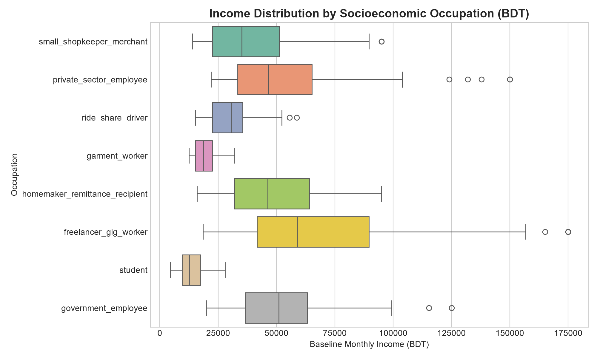
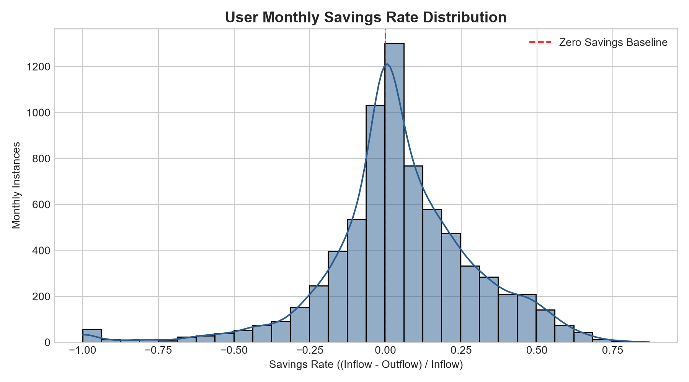
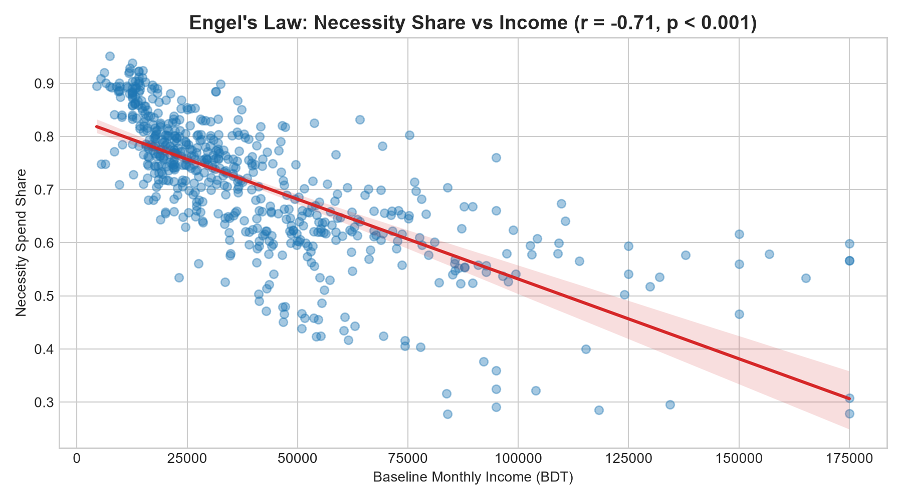
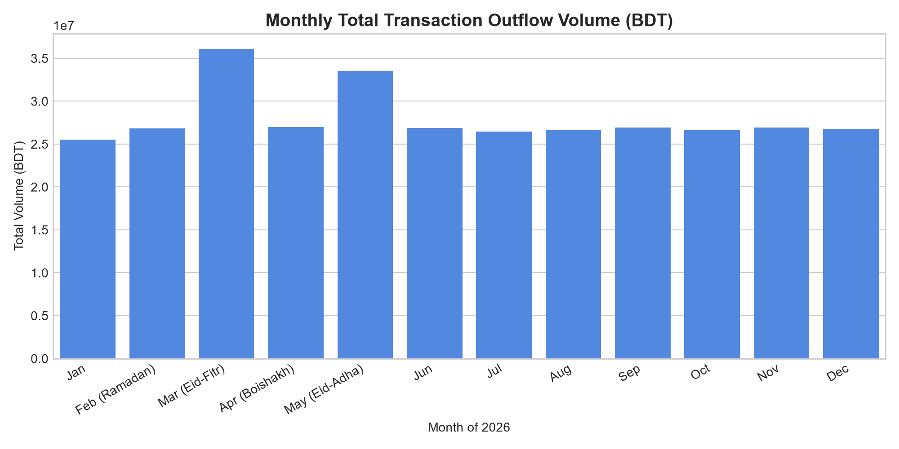
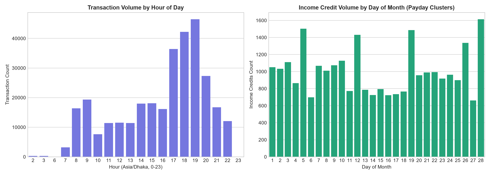
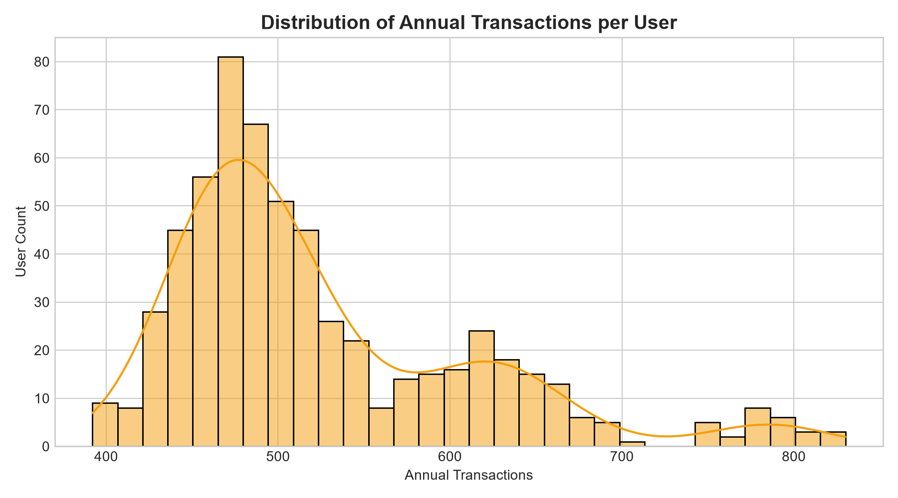
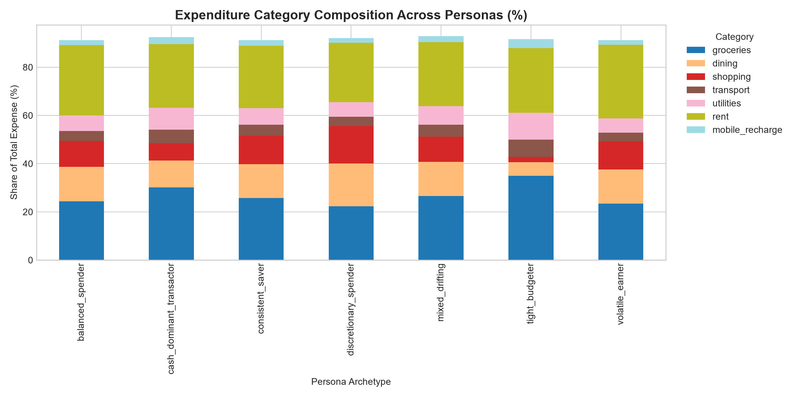

# Synthetic Dataset Statistical Realism Audit Report

**Audit Timestamp:** 2026-10-03 14:21:02  
**Evaluation Status:** [PASSED] ALL REALISM CHECKS VERIFIED  
**Cohort Analyzed:** 600 Users, 314,863 Transactions (12 Months, Asia/Dhaka)  

---

## 1. Executive Realism Scorecard

| Check ID | Statistical Metric Evaluated | Result | Audit Findings |
|---|---|---|---|
| `CHECK_01_INCOME_DIST` | Income Distribution & Occupation Bounds | **PASS** | Income is right-skewed (skewness=1.86 > 0.40). Min income: BDT 4,492, Max: BDT 175,000. |
| `CHECK_02_SAVINGS_RATE` | Savings-Rate Dispersion & Deficit Representation | **PASS** | Savings rates exhibit realistic two-sided dispersion: 39.5% deficit months, 59.3% surplus months (dominant sign < 70% threshold). |
| `CHECK_03_ENGELS_LAW` | Engel's Law Necessity Share Scaling | **PASS** | Statistically significant negative correlation confirmed (r = -0.71, p-val = 1.5676e-94 < 0.01). |
| `CHECK_04_SEASONALITY` | Cultural Calendar & Festival Seasonality Spikes | **PASS** | March (Eid-ul-Fitr) outflow is 1.35x baseline; May (Eid-ul-Adha) outflow is 1.26x baseline. |
| `CHECK_05_TEMPORAL` | Circadian Rhythms & Payday Clustering | **PASS** | Realistic circadian rhythms: daytime/evening peaks are 237.8x higher than midnight troughs. |
| `CHECK_06_TXNS_PER_USER` | Transactions-per-User Activity & Non-Zero Invariant | **PASS** | Zero users with 0 transactions. Min txns/user: 392, Median: 496, Total users: 600. |
| `CHECK_07_PERSONA_SHARES` | Category Composition Divergence by Persona | **PASS** | Archetypes distinct: Discretionary spenders dedicate 17.7% to dining vs 5.6% for tight budgeters. |
| `CHECK_08_LEDGER_INVARIANTS` | Ledger Solvency, ID Uniqueness & Fee Ratio | **PASS** | 0 negative balances, 0 duplicate IDs, 0 future timestamps. Effective cash-out fee charge: 1.64% (calibrated to 1.49%-1.85%). |
| `CHECK_09_NOISE_ANOMALIES` | Anomaly Rate & Tagging Noise Verification | **PASS** | Anomaly rate is 2.48% (spec: 2.0%-3.0%). Noise/other labeling rate is 6.06% (spec: 5.0%-8.0%). |
| `CHECK_10_LEAKAGE` | Ground-Truth Data Leakage Quarantine | **PASS** | Zero ground-truth leakage detected. Forbidden columns in transactions: [], in users: []. |

---

## 2. Statistical Visualizations & Detailed Evidence

### 2.1 Income Distribution by Occupation

### 2.2 Savings-Rate Dispersion & Deficit Representation

### 2.3 Engel's Law Necessity Scaling

### 2.4 Cultural Calendar & Festival Seasonality

### 2.5 Temporal Rhythms & Payday Clustering

### 2.6 Annual Transactions per User

### 2.7 Expenditure Category Mix Across Personas

---

## 3. Ground-Truth Data Leakage Audit

The synthetic feature store architecture strictly enforces physical table quarantine:
- `transactions` and `users` tables contain zero ground-truth labels.
- True labels are quarantined within `synthetic_user_ground_truth` and `synthetic_transaction_ground_truth`.
- Downstream ML models in Phase 5 will train exclusively on precomputed features derived from raw ledger events without label leakage.