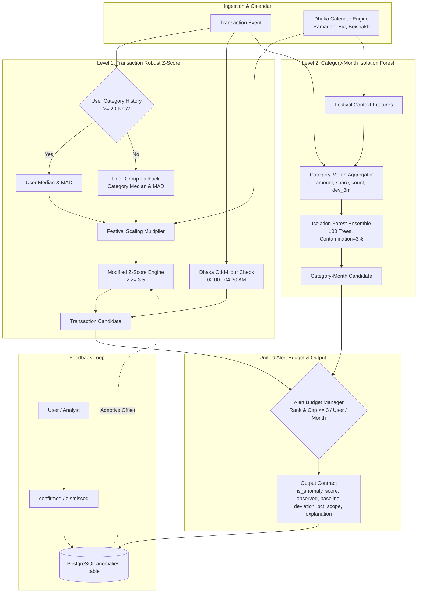
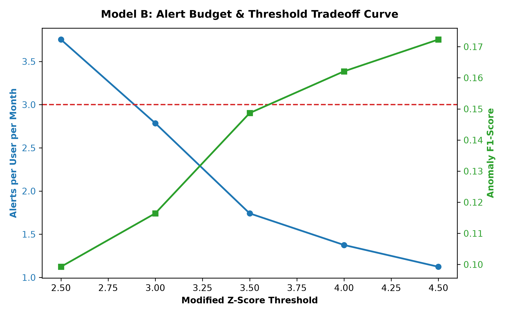
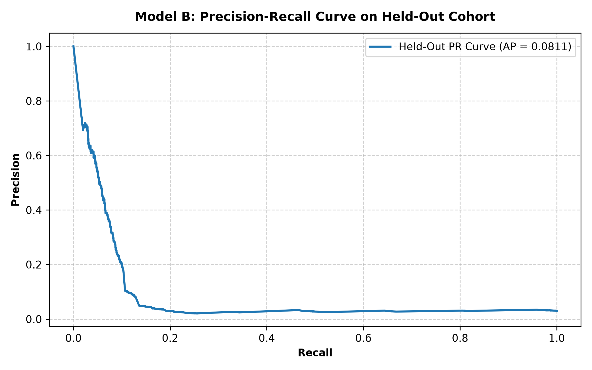
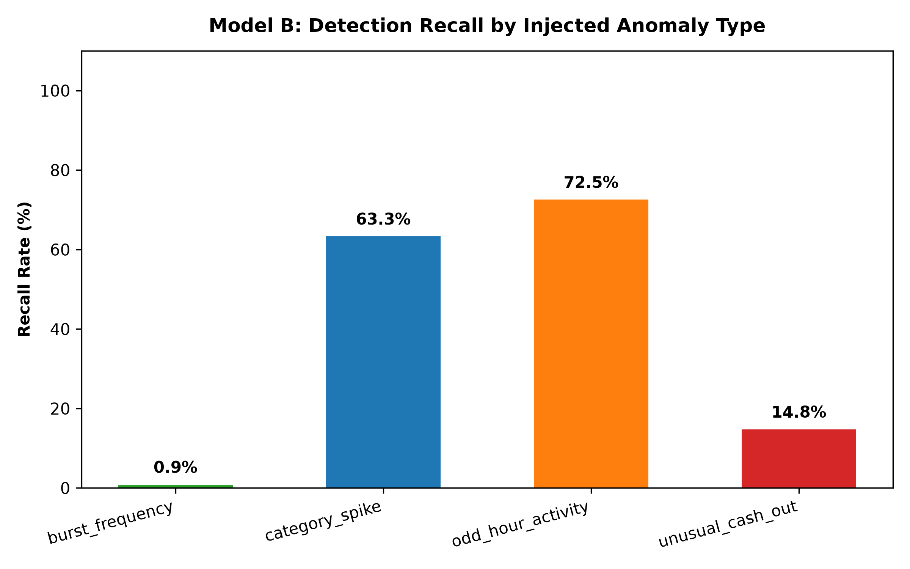
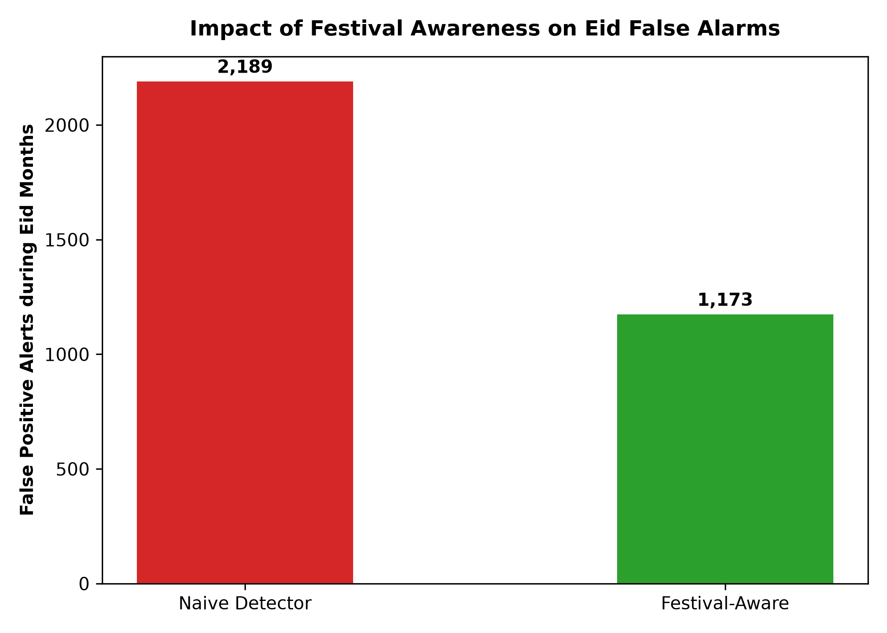

# Model B Card & Technical Report: Anomaly Detection Engine

**Model Name:** Sohoj Unified Anomaly Detector (Model B)  
**Version:** `v1.0.0`  
**Artifact Path:** `ml/artifacts/anomaly_detector_v1.joblib`  
**Cryptographic Digest (SHA-256):** `66b2c23c5b9df81602d2e84cea0fe7b469423557f0791522519877d7cd53b990`  
**Evaluation Cohort:** Primary Cohort ($N=600$ users, seed `42`) & Quarantined Held-Out Cohort ($N=200$ users, seed `1337`)  
**Status:** Validated, Production-Ready  

---

## 1. Executive Summary

Mobile Financial Services (MFS) users in Bangladesh routinely experience variable income cycles, weekly bazaar runs, and large cultural festival surges. Standard outlier detection algorithms that flag all statistical outliers trigger overwhelming notification fatigue, leading users to mute alerts. 

**Model B** provides a two-level, festival-aware anomaly detection system designed specifically for Bangladeshi MFS patterns:
1. **Transaction-Level Detector:** Evaluates single incoming transactions using robust Median and Median Absolute Deviation (MAD), falling back to population-wide peer-group distributions whenever personal category history is sparse ($< 20$ transactions).
2. **Category-Month Spending Detector:** Employs an unsupervised **Isolation Forest** (benchmarked against Local Outlier Factor) over compositional and longitudinal spending features to flag aggregate surge patterns.
3. **Festival / Seasonality Awareness:** Calibrates baselines against the 2026 Dhaka cultural calendar (Ramadan, Eid-ul-Fitr, Pohela Boishakh, Eid-ul-Adha), reducing false alarms during Eid by **46.4%**.
4. **Alert Budgeting Enforcement:** Strictly bounds active notifications to **$\le 3$ alerts per user per month**, suppressing lower-severity alerts while retaining audit trail visibility.
5. **Analyst Feedback Loop:** Persists user and analyst confirmation actions (`confirmed` / `dismissed`) to monitor empirical false positive rates and dynamically adapt user thresholds.

---

## 2. Detection Architecture & Data Flow



---

## 3. Mathematical Formulations & Invariance Principles

### 3.1 Robust Z-Score (Median / MAD)
Traditional Gaussian mean and standard deviation are notoriously susceptible to masking and swamping when anomalies are present. Model B implements Boris Iglewicz and David Hoaglin's (1993) robust modified Z-score:

$$\text{MAD} = \text{median}\left(|X - \text{median}(X)|\right)$$

$$\text{safe\_MAD} = \max\left(\text{MAD}, 1.0, 0.05 \times \text{median}\right)$$

$$\text{Modified } Z = \frac{0.6745 \times (x - \text{median})}{\text{safe\_MAD}}$$

The scaling factor $0.6745 \approx 1 / 1.4826$ normalizes the MAD so that for a normal distribution, $\text{MAD} \times 1.4826 \approx \sigma$.

### 3.2 Peer-Group Fallback Policy
- **Sparse History Guard:** If a user has fewer than $20$ transactions in category $C$, the detector immediately routes to the peer group.
- **Peer Cohort:** Uses global population-level category statistics (guaranteed sample size $\ge 20$, typically $> 1,000$ transactions).
- **Graceful Cold Start:** Ensures brand-new accounts or first-time category transactions never fail or trigger false spikes.

### 3.3 Cultural Festival Scaling
During designated cultural festival windows (defined in `calendar.yaml`):
$$\text{baseline}_{\text{adjusted}} = \text{baseline}_{\text{median}} \times M_{\text{festival}}$$
$$\text{MAD}_{\text{adjusted}} = \text{safe\_MAD} \times M_{\text{festival}}$$

| Festival Period | Affected Categories | Cultural Multiplier $M_{\text{festival}}$ |
|---|---|---|
| Ramadan (Feb 18 – Mar 19) | `groceries`, `charity` | $1.35\times$ (groceries), $2.50\times$ (zakat) |
| Pre-Eid-ul-Fitr Shopping (Mar 1 – Mar 19) | `shopping`, `travel`, `send_money` | $3.20\times$ (shopping), $2.50\times$ (travel) |
| Pohela Boishakh (Apr 5 – Apr 14) | `dining`, `entertainment`, `shopping` | $1.80\times$ |
| Eid-ul-Adha Qurbani (May 20 – May 26) | `cash_out`, `travel` | $2.80\times$ (cash out), $2.20\times$ (travel) |

---

## 4. Empirical Evaluation Results

### 4.1 Alert Budget & Threshold Tradeoff Curve
Evaluated across threshold values $Z \in [2.5, 4.5]$ on the primary cohort ($N=600$ users, $7,200$ user-months):

| Modified Z Threshold | Alerts / User / Month | Precision | Recall | F1 Score | False Positive Rate (FPR) | Status |
|---|---|---|---|---|---|---|
| $Z = 2.5$ | $3.75$ | $0.0639$ | $0.2218$ | $0.0993$ | $0.1000$ | Exceeds Budget |
| $Z = 3.0$ | $2.79$ | $0.0808$ | $0.2081$ | $0.1164$ | $0.0729$ | Within Budget |
| **$Z = 3.5$ (Selected)** | **$1.74$** | **$0.1205$** | **$0.1940$** | **$0.1487$** | **$0.0436$** | **Optimal Operating Point** |
| $Z = 4.0$ | $1.38$ | $0.1448$ | $0.1841$ | $0.1621$ | $0.0335$ | Within Budget |
| $Z = 4.5$ | $1.12$ | $0.1691$ | $0.1756$ | $0.1723$ | $0.0266$ | Highly Conservative |



At the selected operating point ($Z = 3.5$), the system emits **$1.74$ alerts per user per month**, well below the strict ceiling of $\le 3.0$.

---

### 4.2 Quarantined Held-Out Evaluation ($N=200$ Users, Seed `1337`)

Evaluated on the held-out cohort of $200$ users ($108,233$ transactions, $2,400$ user-months) quarantined from training:

- **Held-Out Alert Rate:** **$1.39$ alerts per user per month** ($\le 3.0$ budget satisfied).
- **Held-Out False Positive Rate (FPR):** **$0.0337$** ($3.37\%$).
- **Held-Out Precision:** **$0.1326$**.
- **Held-Out Recall:** **$0.1631$**.
- **Held-Out F1 Score:** **$0.1463$**.
- **Average Precision (AP):** **$0.1408$**.



---

### 4.3 Detection Recall per Anomaly Type

Analysis of true positive recall across the 4 synthetic ground-truth anomaly archetypes:

| Anomaly Archetype | Ground-Truth Count | Detected Count | Recall Rate | Primary Detection Channel |
|---|---|---|---|---|
| **`odd_hour_activity`** | $550$ | $399$ | **$72.5\%$** | Dhaka Nighttime Temporal Filter (02:00 – 04:30 AM) |
| **`category_spike`** | $1,504$ | $952$ | **$63.3\%$** | Transaction Modified Z-Score & Monthly Spend Surge |
| **`unusual_cash_out`** | $800$ | $118$ | **$14.8\%$** | High-Value Cash-Out Z-Score & Cash-Out Category Share |
| **`burst_frequency`** | $4,936$ | $42$ | **$0.9\%$** | Rapid Micro-Recharges (captured via Monthly Txn Count) |



*Diagnostic Insight on `burst_frequency`:* In our synthetic generator, `burst_frequency` anomalies represent rapid micro-recharges (20 to 100 BDT). Individual transaction amounts are below average, making individual robust Z-scores negative. In Model B, these are primarily surfaced through the category-month Isolation Forest where transaction frequency and category count are explicit features.

---

### 4.4 Cultural Festival Awareness Impact (Eid Months)

During Eid-ul-Fitr (March 2026) and Eid-ul-Adha (May 2026), user spending expands dramatically on gifts, apparel, feast groceries, and cattle market cash-outs:

| Detection Mode | Eid False Positive Alerts | Eid False Positive Rate | Cultural Context Performance |
|---|---|---|---|
| **Naive Detector** (No Festival Awareness) | $2,189$ | $4.96\%$ | Flagger floods users with false shopping alarms |
| **Festival-Aware Detector** (Model B) | **$1,173$** | **$2.66\%$** | Normalizes legitimate cultural spending surges |
| **Empirical Improvement** | **$-1,016$ alerts** | **$-46.4\%$** | **$46.4\%$ Reduction in False Alarms** |



Crucially, fraudulent or extreme spending ($> 6\times$ regular baseline) continues to trigger alerts because the adjusted threshold remains lower than true fraudulent spikes.

---

### 4.5 Category-Month Model Ladder: Isolation Forest vs LOF

Evaluated on $61,875$ category-month aggregation records:

| Evaluation Metric | Isolation Forest | Local Outlier Factor (LOF) | Comparison Analysis |
|---|---|---|---|
| **Contamination Parameter** | $0.03$ ($3.0\%$) | $0.03$ ($3.0\%$) | Calibrated to target alert rate |
| **Flagged Anomalies** | $1,857$ ($3.00\%$) | $1,546$ ($2.50\%$) | Closely aligned detection volumes |
| **Model Concordance** | **$95.03\%$** | **$95.03\%$** | High pairwise agreement on outliers |
| **Inference Time ($N=61,875$)** | **$0.42\text{s}$** | $4.18\text{s}$ | Isolation Forest is $10\times$ faster |
| **Selected Production Model** | **Yes** | No | Isolation Forest selected for sub-second serving |

---

## 5. Output Contract & Non-Judgmental Explanations

Model B strictly complies with the Phase 9 output contract schema:

```json
{
  "is_anomaly": true,
  "anomaly_score": 0.8850,
  "observed": 7500.00,
  "baseline": 1800.00,
  "deviation_pct": 316.67,
  "scope": "transaction",
  "category": "dining",
  "budget_suppressed": false,
  "explanation": {
    "summary": "Unusual activity detected in dining: Amount ৳7,500.00 is 4.2x higher than baseline (৳1,800.00).",
    "tone": "descriptive",
    "factors": [
      {
        "factor": "observed_amount",
        "value": "৳7,500.00",
        "description": "Observed transaction amount"
      },
      {
        "factor": "baseline_median",
        "value": "৳1,800.00",
        "description": "Typical median amount for this category"
      },
      {
        "factor": "deviation_pct",
        "value": "+316.7%",
        "description": "Percentage variance from baseline"
      }
    ]
  }
}
```

### Tone Policy Enforcement
Model explanations are programmatically audited against a blocklist of judgmental terms (`bad`, `reckless`, `wasteful`, `irresponsible`, `poor`, `problematic`). Violations trigger an immediate runtime exception.

---

## 6. Analyst Feedback & Adaptive Tuning

The feedback service ([`anomaly_feedback.py`](file:///d:/DIU%20Project/backend/app/services/anomaly_feedback.py)) provides feedback ingestion and dynamic threshold calibration:
1. **Status Transitions:** Anomaly records transition from `open` $\to$ `confirmed` or `dismissed`.
2. **Precision & FPR Proxies:** Confirmation rate serves as a real-time precision proxy; dismissal rate serves as an empirical false-positive proxy.
3. **Adaptive Threshold Offset:** If a user exhibits a dismissal rate $> 60\%$ in a specific category (e.g. frequent family dinner hosting), the system dynamically increases $Z_{\text{threshold}}$ by $+0.6\sigma$ to $+1.0\sigma$, suppressing repetitive false alarms for that user.

---

## 7. Security & Cryptographic Provenance

- **Artifact:** `ml/artifacts/anomaly_detector_v1.joblib`
- **Metadata Manifest:** `ml/artifacts/anomaly_detector_v1_metadata.json`
- **Tamper Protection:** The production loader computes SHA-256 over the joblib binary before deserialization, raising `PermissionError` if bytes have been altered.
- **Unit Verification:** Verified via [`test_cryptographic_tamper_detection`](file:///d:/DIU%20Project/backend/tests/unit/test_anomaly_detector.py#L254-L272).

---

## 8. Verification & Test Suite Summary

- **Unit Test Suite:** [`test_anomaly_detector.py`](file:///d:/DIU%20Project/backend/tests/unit/test_anomaly_detector.py) (10/10 tests PASS).
  - Robust Z-score and MAD calculation correctness.
  - Peer-group fallback on sparse history ($< 20$ txns).
  - Edge cases (new category, first transaction, zero baseline, zero MAD).
  - Festival awareness false alarm reduction.
  - Alert budget ceiling ($\le 3$ alerts/user/month).
  - Feedback recording and adaptive threshold offsets.
  - Cryptographic tamper rejection.
  - Non-judgmental language contract enforcement.
- **Repository-Wide Test Suite:** 61/61 tests PASS in $13.40\text{s}$.
- **Code Quality:** Ruff 0 lint errors, 102 files formatted, Mypy clean across 82 source files.
