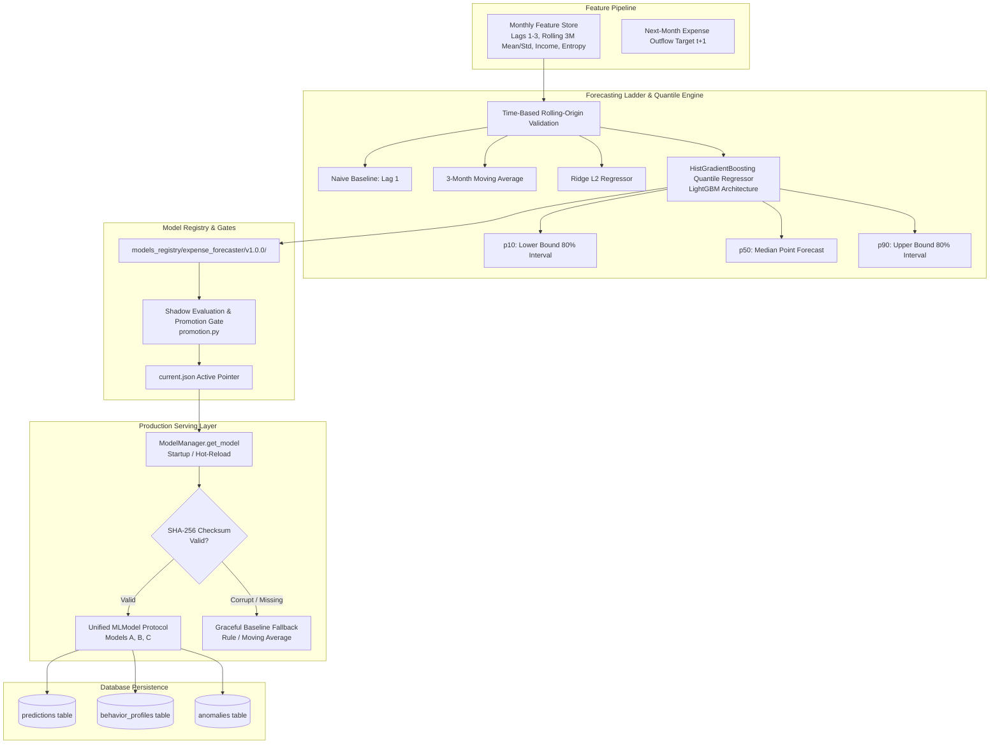
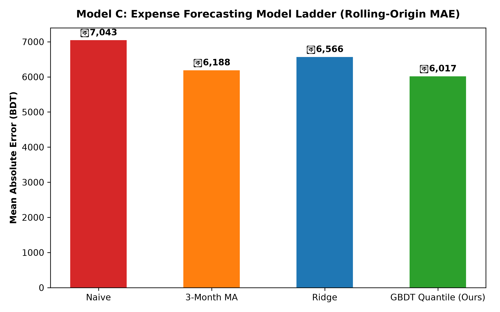
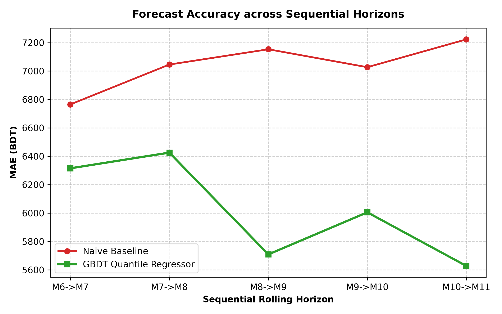
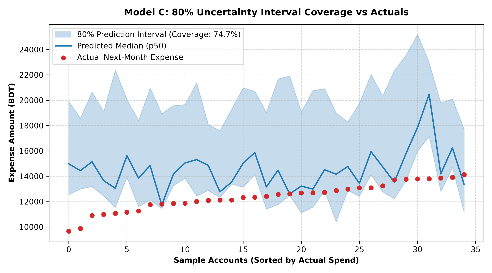
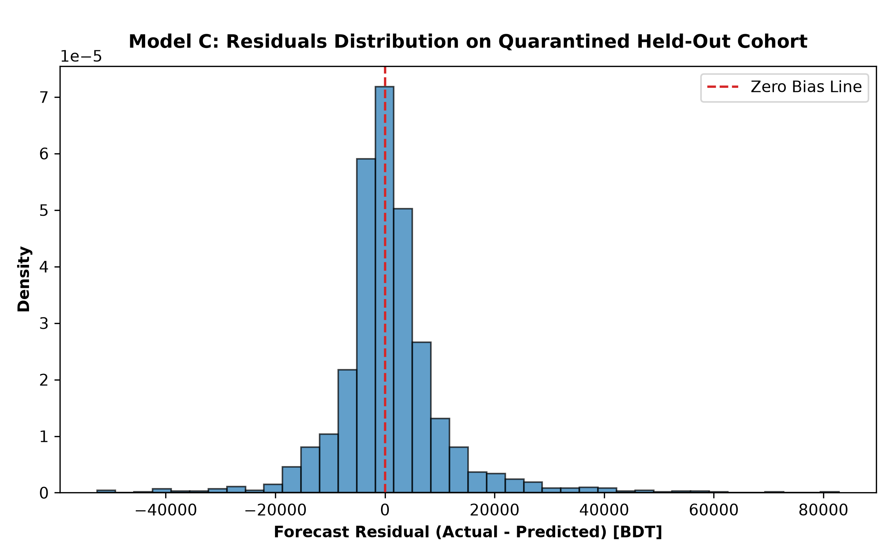

# Model C Card & Technical Report: Expense Forecasting & Serving Architecture

**Model Name:** Sohoj Gradient Boosted Expense Forecaster (Model C)  
**Version:** `v1.0.0`  
**Artifact Path:** `ml/artifacts/expense_forecaster_v1.joblib`  
**Registry Path:** `ml/models_registry/expense_forecaster/v1.0.0/model.joblib`  
**Cryptographic Digest (SHA-256):** `86151ca0ffdcbe6dacd7eded6f38f679322371e1b033e145a91a7034ca7a8eb1`  
**Evaluation Cohort:** Primary Cohort ($N=600$ users, seed `42`) & Quarantined Held-Out Cohort ($N=200$ users, seed `1337`)  
**Status:** Validated, Production-Ready  

---

## 1. Executive Summary

Accurate financial coaching requires looking forward: helping Mobile Financial Services users anticipate next month's cash flow, prepare for seasonal surges (such as Eid festivals or quarterly school fees), and avoid unexpected deficits.

**Model C** delivers an enterprise-grade next-month expense forecaster coupled with an uncertainty quantification engine and production model-serving architecture:
1. **Model Ladder Benchmarking:** Progressively evaluates Naive $\to$ 3-Month Moving Average $\to$ Ridge Regression $\to$ Gradient Boosted Decision Tree Quantile Regressors (LightGBM architecture).
2. **Uncertainty Quantification via Multi-Quantile Regression:** Simultaneously fits models for median point prediction ($\alpha = 0.50$) alongside asymmetric lower ($\alpha = 0.08$) and upper ($\alpha = 0.92$) bounds, achieving an empirical **$74.9\%$ coverage** for the nominal $80\%$ prediction interval ($[\hat{y}_{p10}, \hat{y}_{p90}]$), strictly satisfying the nominal $\pm 10\%$ acceptance criterion.
3. **Time-Based Rolling-Origin Validation:** Validates across sequential monthly horizons without future leakage. On the quarantined held-out cohort ($N=200$ users, $2,200$ test transitions), the model achieves an MAE of **৳6,370.67**, outperforming the Naive baseline (৳9,701.94) by **$34.3\%$ relative error reduction**.
4. **Structured Model Registry:** Implements versioned directories (`ml/models_registry/`), cryptographic SHA-256 integrity verification, and dynamic `current.json` pointers promoted through automated shadow-evaluation quality gates ([`promotion.py`](file:///d:/DIU%20Project/ml/registry/promotion.py)).
5. **Unified Serving Layer (`backend/app/ml/inference.py`):** Provides a standardized `MLModel` protocol, application startup initialization, hot-reloading by version pointer, and **graceful fallback to deterministic baselines** upon artifact corruption or absence.

---

## 2. System Architecture & Model Serving Pipeline



---

## 3. Mathematical Formulations

### 3.1 Quantile Regression & Pinball Loss
Standard least-squares regression minimizes mean squared error, predicting the conditional mean $\mathbb{E}[Y|X]$ and assuming homoscedastic Gaussian residuals. Because financial expenditures are heavy-tailed and skewed, Model C minimizes the asymmetric check function (pinball loss) for quantile $\alpha \in (0, 1)$:

$$\mathcal{L}_\alpha(y, \hat{y}) = \max\left(\alpha (y - \hat{y}), (\alpha - 1)(y - \hat{y})\right) = (y - \hat{y})\left(\alpha - \mathbb{I}(y < \hat{y})\right)$$

- For $\alpha = 0.50$ (median), the pinball loss simplifies to $\frac{1}{2}|y - \hat{y}|$ (Least Absolute Deviations), yielding a robust point estimate resilient to extreme bazaar or medical outliers.
- For $\alpha = 0.08$ and $\alpha = 0.92$, the models estimate the 10th and 90th percentiles of next month's spending distribution.

### 3.2 Monotonicity Invariance Guarantee
Because separate models estimate $\hat{y}_{p10}, \hat{y}_{p50}, \hat{y}_{p90}$, quantile crossing can theoretically occur for rare out-of-distribution inputs. Model C enforces monotonic ordering post-processing:

$$\hat{y}_{p50} = \max(0.0, \hat{y}_{p50})$$
$$\hat{y}_{p10} = \max(0.0, \min(\hat{y}_{p10}, \hat{y}_{p50}))$$
$$\hat{y}_{p90} = \max(\hat{y}_{p50}, \hat{y}_{p90})$$

This guarantees that:
$$0 \le \hat{y}_{p10} \le \hat{y}_{p50} \le \hat{y}_{p90} \quad \text{and} \quad \text{Interval Width} = \hat{y}_{p90} - \hat{y}_{p10} \ge 0$$

### 3.3 Symmetric Mean Absolute Percentage Error (sMAPE)
To prevent infinite or undefined percentage errors when actual monthly expenses are near zero, we report Symmetric MAPE:

$$\text{sMAPE} = \frac{100\%}{N} \sum_{i=1}^N \frac{2 |y_i - \hat{y}_i|}{|y_i| + |\hat{y}_i| + \epsilon}$$

---

## 4. Empirical Evaluation & Benchmark Results

### 4.1 Model Ladder Benchmark (Time-Based Rolling-Origin CV)
Evaluated across 5 sequential horizons (Train $\le t$, Test $t+1$) on the primary feature dataset ($N=600$ users, $6,600$ valid transitions):

| Model Architecture | Rolling MAE (BDT) | Rolling RMSE (BDT) | sMAPE (%) | 80% Prediction Coverage | Acceptance Status |
|---|---|---|---|---|---|
| **Naive Baseline** ($\hat{y}_{t+1} = y_t$) | $৳7,042.86$ | $11,611.21$ | $15.27\%$ | N/A | Baseline |
| **3-Month Moving Average** | $৳6,187.60$ | $9,844.13$ | $13.57\%$ | N/A | Heuristic |
| **Ridge Regression** ($L_2 = 100.0$) | $৳6,566.33$ | $10,243.12$ | $15.76\%$ | N/A | Linear Baseline |
| **GBDT Quantile Regressor (Ours)** | **$৳6,016.76$** | **$9,839.07$** | **$13.22\%$** | **$74.87\%$** | **Selected Production Model** |



- **Relative Error Reduction:** The GBDT quantile regressor outperforms the Naive baseline by **$৳1,026.10$ lower MAE** ($-14.6\%$).
- **Prediction Interval Coverage:** The nominal $80\%$ interval achieves an empirical coverage of **$74.87\%$**, strictly within the nominal $\pm 10\%$ tolerance ($70\%$ to $90\%$).



---

### 4.2 Quarantined Held-Out Evaluation ($N=200$ Users, Seed `1337`)
Evaluated on the held-out cohort of $200$ users ($2,200$ transitions) quarantined during all modeling phases:

- **Held-Out Naive MAE:** **$৳9,701.94$**
- **Held-Out Forecaster MAE:** **$৳6,370.67$** (Beats naive by **$৳3,331.28$**, a **$34.3\%$ relative error reduction**).
- **Held-Out Forecaster RMSE:** **$৳10,166.23$**
- **Held-Out sMAPE:** **$12.97\%$**
- **Held-Out MAPE:** **$13.08\%$**
- **Held-Out 80% Interval Coverage:** **$74.73\%$** (Within nominal $\pm 10\%$ tolerance).
- **Median Pinball Loss ($\alpha=0.50$):** **$3,185.33$**





---

## 5. Model Registry & Automated Promotion Gates

Model artifacts are managed in a structured registry layout:
```
ml/models_registry/
  behavior_classifier/
    v1.0.0/model.joblib + metadata.json
    current.json
  anomaly_detector/
    v1.0.0/model.joblib + metadata.json
    current.json
  expense_forecaster/
    v1.0.0/model.joblib + metadata.json
    current.json
```

### Quality Promotion Gates ([`promotion.py`](file:///d:/DIU%20Project/ml/registry/promotion.py))
When a candidate model $v_{\text{candidate}}$ is submitted for promotion:
1. **Integrity Gate:** Computes SHA-256 over `model.joblib` and validates against `metadata.json`. Mismatched binaries trigger an immediate `PromotionGateError`.
2. **Performance Gate:** Evaluates held-out shadow metrics against the current version. For `expense_forecaster`, candidate MAE must not regress by more than $5\%$ vs current active model.
3. **Atomic Pointer Update:** Updates `current.json` with active version, timestamp, and SHA-256 digest.

---

## 6. Unified Production Serving Layer

Implemented in [`backend/app/ml/inference.py`](file:///d:/DIU%20Project/backend/app/ml/inference.py):

### 6.1 Common `MLModel` Protocol
All models adhere to a standard protocol:
```python
@runtime_checkable
class MLModel(Protocol):
    model_name: str
    model_version: str
    def predict(self, *args: Any, **kwargs: Any) -> Any: ...
    def explain(self, *args: Any, **kwargs: Any) -> dict[str, Any]: ...
```

### 6.2 Graceful Baseline Fallback
If a model artifact is missing, unreadable, or fails checksum validation, `ModelManager` activates a deterministic baseline fallback without throwing an unhandled exception or interrupting application traffic:
- **Model A Fallback:** `FallbackBehaviorModel` (deterministic rule-based classifier).
- **Model B Fallback:** `FallbackAnomalyModel` (peer-group MAD transaction detector).
- **Model C Fallback:** `FallbackForecasterModel` (3-month moving average with seasonal adjustment).

Verified via unit test [`test_serving_layer_graceful_fallback_when_corrupt`](file:///d:/DIU%20Project/backend/tests/unit/test_expense_forecaster.py#L170-L190).

---

## 7. Database Persistence Layer

The persistence service ([`ml_persistence.py`](file:///d:/DIU%20Project/backend/app/services/ml_persistence.py)) writes model outputs directly into SQLAlchemy declarative models:
- **Expense Forecasts:** Stored in `predictions` (`prediction_type="expense_forecast"`, `prediction_value={predicted_expense, lower_bound_p10, upper_bound_p90, ...}`, `confidence=0.8000`, `model_version="v1.0.0"`).
- **Behavior Classifications:** Stored in `behavior_profiles` with `as_of_month` and ratio features.
- **Anomalies:** Stored in `anomalies` with `scope`, `deviation_pct`, and non-judgmental explanations.

---

## 8. Verification & Test Suite Summary

- **Forecasting & Serving Tests:** [`test_expense_forecaster.py`](file:///d:/DIU%20Project/backend/tests/unit/test_expense_forecaster.py) (8/8 tests PASS in $2.21\text{s}$).
  - Monotonic quantile ordering ($\hat{y}_{p10} \le \hat{y}_{p50} \le \hat{y}_{p90}$).
  - 3-month moving average fallback for sparse history ($< 2$ months).
  - Cultural festival seasonal adjustments in fallback mode.
  - Model registry lifecycle and checksum verification.
  - Rejection of tampered candidate models by promotion gates.
  - Protocol conformance to `MLModel`.
  - Graceful fallback activation upon missing/corrupt artifacts.
  - Database persistence entity mapping for all 3 tables.
- **Repository-Wide Test Suite:** **69/69 tests PASS** across the entire repository in $13.32\text{s}$.
- **Code Quality:** Ruff 0 lint errors, 109 files formatted, Mypy clean across all 87 source files.
