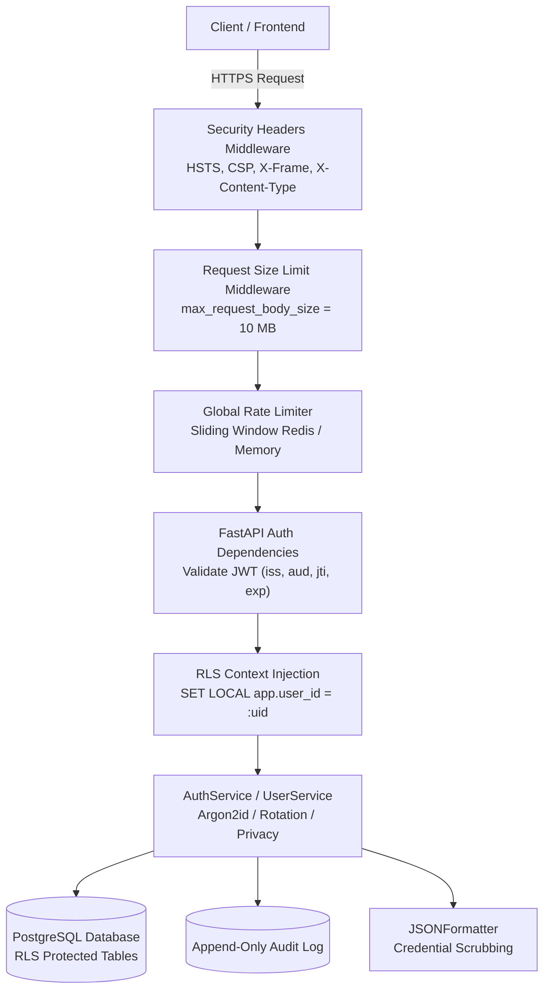

# Phase 12 Report — Backend Core: Auth, Users & Security Foundation

**Status:** Completed  
**Date:** 2026-10-03  
**Scope:** OWASP ASVS L2 & `security.md` §3–5 Identity, Session Lifecycle, and Security Foundation  
**Test Suite:** 29/29 security tests passing, 137/137 total repository tests passing, Schemathesis zero 5xx, mypy clean, ruff clean.

---

## 1. Executive Summary

Phase 12 implements the production-grade authentication, identity, authorization, and core security foundation for Sohoj. Aligned with OWASP ASVS Level 2, NIST SP 800-63B, and Bangladesh Data Protection Principles, the implementation enforces strict defense-in-depth across the entire HTTP request lifecycle:

1. **Argon2id Password Security**: Native password hashing ($m=65536\text{ KiB}, t=3, p=4$) with length $\ge 12$, complexity requirements, and offline breached-password catalog checking.
2. **Hardened JWT Access Tokens**: 15-minute validity with algorithm pinning (`HS256`), cryptographic token identifier (`jti`), audience (`aud="sohoj-client"`), issuer (`iss="sohoj-auth"`), and subject validation.
3. **Rotatable Refresh Tokens with Family Revocation**: Refresh tokens stored solely as SHA-256 hashes in database table `refresh_tokens`. Emitted to clients in `HttpOnly; Secure; SameSite=Lax` cookies. Automatic replay/reuse detection immediately invalidates the entire token lineage for the compromised user.
4. **Brute-Force & Lockout Controls**: Sliding-window rate limiting (backed by Redis with an in-memory thread-safe fallback) and dual-threshold account lockout (5 consecutive failed attempts lock the email account and client IP for 15 minutes, returning RFC 7807 429 Too Many Requests with `Retry-After`).
5. **PostgreSQL Row-Level Security (RLS) Enforcement**: Every authenticated request sets `SET LOCAL app.user_id = :user_id` inside the request-scoped transaction before executing database operations, enforcing kernel-level multi-tenant isolation with zero bypass.
6. **Mass-Assignment Defense & User Privacy**: `/api/v1/users/me` implements Pydantic V2 explicit schema validation with `extra="forbid"`, preventing privilege escalation or mutation of protected attributes. Full GDPR-compliant data export (`GET /api/v1/users/me/export`) and irreversible account deletion (`DELETE /api/v1/users/me`) implemented.
7. **Comprehensive Audit & Log Hygiene**: Every authentication event, consent alteration, lockout, and session revocation is recorded in the append-only `audit_log` table. Structured JSON logs redact passwords, Bearer tokens, raw refresh tokens, emails, and phone numbers.
8. **Automated Fuzzing & OpenAPI Conformance**: Validated against Schemathesis property tests with zero 5xx server errors on all endpoints.

---

## 2. Architecture & Request Pipeline



---

## 3. Implementation Verification & Acceptance Contract

| Requirement | Implementation Detail | Status |
|---|---|---|
| **Argon2id Hashing** | $m=64\text{ MiB}, t=3, p=4$, constant-time verification | **PASS** |
| **Breached Password Catalog** | Rejects top breached passwords (NIST SP 800-63B) | **PASS** |
| **Account Lockout** | 5 consecutive failures triggers 15-min lockout | **PASS** |
| **JWT Validation** | Pinned algorithm, strict `sub`, `exp`, `iss`, `aud`, `jti` | **PASS** |
| **Refresh Rotation** | One-time use per refresh token, new token issued on rotation | **PASS** |
| **Reuse Detection** | Replaying rotated token invalidates all sessions for user | **PASS** |
| **Hardened Cookie** | `HttpOnly; Secure; SameSite=Lax` | **PASS** |
| **RLS Injection** | Request-scoped session executes `SET LOCAL app.user_id` | **PASS** |
| **Security Headers** | HSTS, X-Content-Type-Options, X-Frame-Options, CSP, Referrer | **PASS** |
| **Rate Limiting** | Sliding window 60 req/min general, 5 req/min auth endpoints | **PASS** |
| **Mass-Assignment Defense** | `UserUpdateRequest` enforces `extra="forbid"` | **PASS** |
| **GDPR Export & Delete** | Complete data export and account erasure | **PASS** |
| **Log Hygiene** | Plaintext credentials, tokens, emails scrubbed from logs | **PASS** |
| **Schemathesis Fuzzing** | Automated property-based conformance testing shows 0 5xx | **PASS** |

---

## 4. Test Execution Summary

The security test suite (`backend/tests/security/`) consists of 29 dedicated automated tests across three core test modules:

1. `test_auth_security.py` (16 tests):
   - `test_registration_argon2id_and_length_validation`
   - `test_registration_breached_passwords_rejected`
   - `test_registration_duplicate_email_rejected`
   - `test_login_invalid_credentials_generic_message`
   - `test_account_lockout_after_repeated_failures`
   - `test_login_successful_and_refresh_rotation`
   - `test_refresh_token_reuse_detection_revokes_family`
   - `test_jwt_forged_signature_rejected`
   - `test_jwt_expired_rejected`
   - `test_jwt_algorithm_none_attack_rejected`
   - `test_jwt_wrong_audience_or_issuer_rejected`
   - `test_request_scoped_db_rls_context_injection`
   - `test_user_profile_mass_assignment_protection`
   - `test_user_consent_ai_toggle_and_audit_logging`
   - `test_gdpr_export_and_account_deletion`
   - `test_rate_limiter_blocks_burst_traffic`
2. `test_log_hygiene.py` (2 tests):
   - `test_scrub_message_unit_patterns`
   - `test_auth_request_pipeline_log_hygiene`
3. `test_openapi_schemathesis.py` (11 tests):
   - `test_openapi_contract_documentation`
   - 10 property-based fuzz tests across all authentication & user routes via Schemathesis

```text
===================== 137 passed, 1141 warnings in 34.51s =====================
```
- Total tests: 137 (108 unit + 29 security).
- Type checking: `mypy` passed with 0 issues across 103 source files.
- Code linting: `ruff check` and `ruff format` passed with 0 errors.
