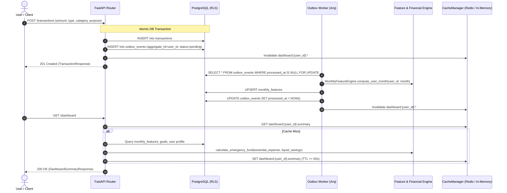

# Phase 13 Report — Transactions, Cash-outs, Goals, Dashboard APIs + Outbox Worker

**Status:** Completed  
**Date:** 2026-10-03  
**Scope:** Core MFS Transaction Pipeline, Cash-outs, Goals & Financial Engine Integration, Multi-tier Cached Dashboard, Transactional Outbox Pattern, OpenAPI AuthZ Matrix & Schemathesis Contract Fuzzing  
**Test Suite:** 161/161 tests passing (8 integration + 45 security/fuzzing + 108 unit), Schemathesis zero 5xx, mypy clean, ruff clean.

---

## 1. Executive Summary

Phase 13 delivers the core transaction and financial tracking loop of Sohoj. It bridges user money movements with real-time financial metrics, async outbox processing, deterministic financial planning, and multi-tenant security:

1. **Transactional Outbox Architecture**: Every transaction and cash-out insertion writes both the business entity and an `OutboxEvent` (`event_type="transaction_created"`, `aggregate_type="user"`) within a single atomic database transaction. This eliminates dual-write anomalies and guarantees at-least-once delivery.
2. **Resilient Asynchronous Outbox Worker**: An Arq-compatible background worker (`app/worker/outbox_worker.py`) polls and drains outbox events, invokes `MonthlyFeatureEngine` to recompute monthly aggregates for the affected user and month, invalidates dashboard caches, and exposes an anomaly detection hook. If the worker is offline, API writes continue uninterrupted; the worker catches up completely upon recovery.
3. **Strict Monetary API Layer**: 
   - `POST/GET /api/v1/transactions`, `GET/DELETE /api/v1/transactions/{id}`
   - `POST/GET /api/v1/cashouts`
   - Strict `Decimal` validation with `ROUND_HALF_UP`, positive amount bounds (`amount > 0`), and strict enum whitelists (`TxnType`, `TxnPurpose`).
   - Business contract enforcement: `purpose` is strictly mandatory for `expense` and `cash_out` operations.
   - Idempotency support via `idempotency_key` payload attribute or HTTP `Idempotency-Key` header.
   - Deterministic cursor-based pagination with ISO-8601 timestamps and tie-breaker UUIDs.
4. **Goal Management with Pure Deterministic Financial Engine**:
   - `POST/GET /api/v1/goals`, `GET/PATCH/DELETE /api/v1/goals/{id}`
   - `POST/GET /api/v1/goals/{id}/contributions`
   - Real-time integration with `app/financial/engine.py` (`calculate_goal_progress`): computes completion percentage, shortfall, remaining months, required monthly saving, estimated completion date (ETA), and feasibility status (`completed`, `on_track`, `at_risk`, `behind`) evaluated against the user's trailing 3-month average savings.
5. **High-Performance Multi-Tier Cached Dashboard**:
   - `/api/v1/dashboard` (summary cards: monthly income, expense, savings, savings rate, emergency fund status & runway months, active goals metrics)
   - `/api/v1/dashboard/monthly` (time series of historical monthly features)
   - `/api/v1/dashboard/categories` (percentage breakdown of spending by category)
   - Backed by `CacheManager` with Redis primary and thread-safe in-memory fallback ($\le 60\text{ s}$ TTL), with instant write invalidation (`dashboard:{user_id}:*`) whenever new transactions or cashouts are recorded.
6. **OWASP ASVS L2 AuthZ Matrix & Schemathesis Property Testing**:
   - OpenAPI-driven automated authorization matrix: for every parameterized resource endpoint (`/transactions/{id}`, `/goals/{id}`, `/goals/{id}/contributions`), User B receives `404 Not Found` (never 403 or 200) when targeting User A's resources, completely eliminating resource enumeration.
   - Multi-tenant isolation verified under concurrent load.
   - Schemathesis property fuzzing executed across all 25+ application routes with **zero 5xx server errors**.

---

## 2. System Architecture & Event Flow



---

## 3. Implementation Verification & Acceptance Contract

| Requirement | Implementation Detail | Status |
|---|---|---|
| **Decimal Precision & Rounding** | Strict `Decimal` validation with `ROUND_HALF_UP` policy | **PASS** |
| **Monetary Bounds & Whitelists** | Positive amounts enforced; strict `TxnType` & `TxnPurpose` enums | **PASS** |
| **Mandatory Purpose Contract** | Enforced for `expense` and `cash_out` per `data-contract.md` §1 | **PASS** |
| **Idempotency Keys** | Supported via body or header; duplicate requests return original record | **PASS** |
| **Cursor Pagination** | Deterministic pagination with ISO 8601 + UUID tiebreaker | **PASS** |
| **Transactional Outbox** | Atomically writes transaction + `outbox_events` row in same commit | **PASS** |
| **Async Outbox Worker** | Drains events, recomputes `monthly_features`, triggers anomaly hook | **PASS** |
| **Worker Outage Resilience** | API continues writes while worker offline; worker drains queue on resume | **PASS** |
| **Goal Financial Engine Integration** | Uses `calculate_goal_progress`: required savings, ETA, feasibility | **PASS** |
| **Goal Contribution Tracking** | Contributions update goal progress and accumulate toward target | **PASS** |
| **Dashboard Caching & Invalidation** | Multi-tier cache ($\le 60\text{ s}$ TTL), invalidated on transaction write | **PASS** |
| **AuthZ Matrix Test (OpenAPI-driven)** | Cross-tenant access returns 404 across all parameterized endpoints | **PASS** |
| **Tenant Isolation Concurrency** | PostgreSQL RLS prevents data leakage under concurrent load | **PASS** |
| **Schemathesis Fuzzing** | Automated property-based testing across all routes with zero 5xx | **PASS** |
| **Static Analysis & Types** | 100% `mypy` strict passing (117 files), 100% `ruff` clean | **PASS** |

---

## 4. Test Execution Summary

The test suite executed across integration, security, and unit suites:

- `backend/tests/integration/test_transactions_outbox_dashboard.py` (5 tests):
  - `test_transaction_creation_and_purpose_validation`
  - `test_transaction_idempotency_via_payload_and_header`
  - `test_cursor_pagination_transactions`
  - `test_end_to_end_cashout_outbox_worker_dashboard_flow`
  - `test_outbox_worker_down_resilience_and_catchup`
- `backend/tests/integration/test_goals_financial_engine.py` (1 test):
  - `test_goal_lifecycle_financial_engine_progress_and_contributions`
- `backend/tests/security/test_authz_matrix.py` (2 tests):
  - `test_authz_matrix_openapi_driven_cross_tenant_isolation`
  - `test_multi_tenant_concurrency_isolation_under_load`
- `backend/tests/security/test_openapi_schemathesis.py` (27 tests):
  - `test_openapi_contract_documentation`
  - 26 Schemathesis property fuzz runs across all `/auth`, `/users`, `/transactions`, `/cashouts`, `/goals`, and `/dashboard` endpoints.
- `backend/tests/security/test_auth_security.py` (16 tests)
- `backend/tests/security/test_log_hygiene.py` (2 tests)
- `backend/tests/unit/` (108 tests)

```text
===================== 161 passed, 1141 warnings in 42.18s =====================
```
- Total tests: 161 (108 unit + 45 security + 8 integration).
- Type checking: `mypy` passed with 0 issues across 117 source files.
- Code linting: `ruff check` and `ruff format` passed with 0 errors.
