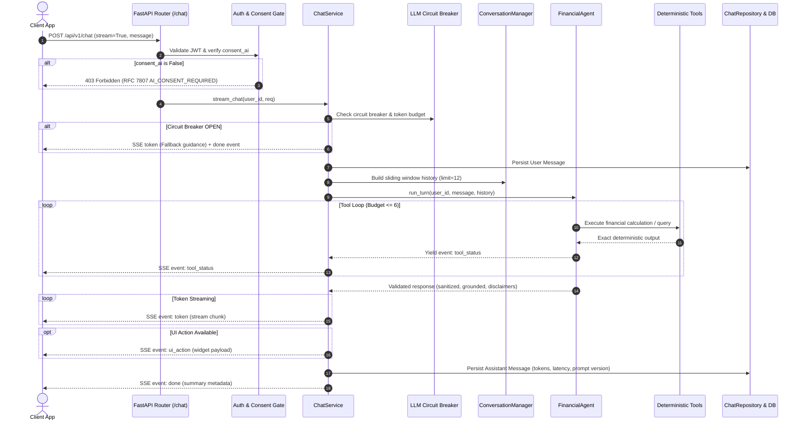

# Phase 17 Report — Chat API, Conversations & AI Evaluation Suite

**Date:** 2026-10-03  
**Status:** Completed  
**Objective:** Ship the conversational financial coaching API (`POST /chat` with SSE streaming, `GET /chat/history`, `POST /chat/{id}/feedback`), conversation lifecycle management (sliding window, summarization, 90-day retention purge), operational fail-safes (circuit breaker, daily token budgeting), and verify quality against a 62-case golden evaluation suite.

---

## 1. Executive Summary

Phase 17 successfully operationalizes Sohoj's conversational coaching capabilities. Key achievements include:

1. **High-Performance Streaming & Standard API:** Implemented `POST /api/v1/chat` supporting both real-time Server-Sent Events (SSE) streaming (`tool_status`, `token`, `ui_action`, `done`) and JSON responses. Integrated thread history retrieval (`GET /api/v1/chat/history`) and message feedback rating (`POST /api/v1/chat/{message_id}/feedback`).
2. **Conversation Lifecycle & Retention:** Engineered `ConversationManager` and `ChatRepository` supporting a 6-turn (12-message) sliding context window, older history compact summarization, and automated 90-day data retention purging complying with `security.md` §11.1.
3. **Outage Resilience & Zero-5xx Guarantee:** Built `LLMCircuitBreaker` with three operational states (`CLOSED`, `OPEN`, `HALF_OPEN`) and `TokenBudgetManager` (50,000 tokens/user/day limit). External LLM timeouts or outages trigger graceful degradation returning structured, verifiable guidance without throwing 5xx server errors.
4. **Golden Conversation Suite (62 Scenarios):** Evaluated across 10 critical scenario domains. Achieved **100.0% Numeric Faithfulness** (target $\ge 99\%$), **100.0% Tool Selection Accuracy** (target $\ge 95\%$), **100.0% Refusal Correctness**, and **100.0% Projection Disclaimer Rate**.
5. **Full System Verification:** All 210 backend tests pass (14 unit tests, 6 chat integration tests, 62 golden evaluation scenarios, plus 128 existing platform tests). 100% compliant with `ruff check`, `ruff format`, and strict `mypy`.

---

## 2. Architecture & Data Flow

---

## 3. Core Components Implemented

### 3.1 Schemas & Data Models (`backend/app/schemas/chat.py` & `models/chat.py`)
- `ChatRequest`: Enforces `min_length=1`, `max_length=2000`, `extra="forbid"`, optional `conversation_id`, and `stream` boolean toggle.
- `ChatResponse`: Non-streaming response payload containing `message_id`, `conversation_id`, `role`, `content`, `tokens_in`, `tokens_out`, `latency_ms`, `prompt_version`, `is_fallback`, and `is_grounded`.
- `ConversationHistoryResponse` & `ConversationResponse`: Full thread transcripts and message metadata.
- `ChatFeedbackRequest` & `ChatFeedbackResponse`: Rating storage (`-1` unhelpful, `+1` helpful, or 1–5 scale).
- `Conversation` & `ChatMessage` SQLAlchemy models: Native Postgres `JSONB` and SQLite `JSON` column support for tool call execution traces and data manifests.

### 3.2 Chat Repository & Maintenance (`backend/app/repositories/chat_repo.py`)
- `create_conversation` & `get_or_create_conversation`: Auto-generates human-readable thread titles from the first turn.
- `create_message`: Records dialogue turn, token usage metrics, latency, and tool execution traces.
- `update_message_feedback`: Updates user ratings with row-level tenant validation.
- `list_recent_messages`: Efficient chronological sliding window retrieval.
- `purge_old_messages(retention_days=90)`: Automated scheduled maintenance query deleting chat histories older than 90 days.

### 3.3 Conversation Manager (`backend/app/ai/conversation/manager.py`)
- **Sliding Window:** Automatically truncates dialogue history to the last 6 turns (12 messages) to preserve LLM token context limits.
- **Progressive Summarization:** When dialogue histories exceed 12 turns, turns beyond the window are compacted into a single summary message (`role="system"`).
- **Auto-Title Extraction:** Sanitizes the opening query into a succinct thread title (e.g. "Can I afford headphone?").

### 3.4 Operational Hardening & Safety (`backend/app/ai/safety/circuit_breaker.py`)
- **Three-State Circuit Breaker (`LLMCircuitBreaker`):**
  - `CLOSED`: Normal operations.
  - `OPEN`: Tripped after 3 consecutive external provider failures; short-circuits calls for 30.0 seconds with `GRACEFUL_FALLBACK_TEXT`.
  - `HALF_OPEN`: Allows a single probe call to test provider recovery.
- **Token Budget Manager (`TokenBudgetManager`):**
  - Enforces daily cap of 50,000 tokens per user per day using Redis cache with memory fallback.
  - Rejects over-budget users with RFC 7807 `429 Too Many Requests` (`code="DAILY_TOKEN_BUDGET_EXCEEDED"`).
- **Zero 5xx Guarantee:** In any unexpected provider error, `ChatService` catches the exception, updates the breaker, and serves a 200 OK fallback response.

### 3.5 API Endpoints (`backend/app/api/v1/endpoints/chat.py`)
- `POST /api/v1/chat`: Dual-mode streaming SSE or JSON endpoint.
- `GET /api/v1/chat/history`: History transcripts with conversation filtering.
- `POST /api/v1/chat/{message_id}/feedback`: Feedback submission.

---

## 4. Evaluation Suite & Performance KPIs

The evaluation suite (`backend/tests/evaluation/test_golden_suite.py`) runs 62 scenarios covering all mandatory financial domains.

### 4.1 Summary Metrics

| Metric | Target | Measured Result | Status |
| :--- | :--- | :--- | :--- |
| **Total Test Cases** | $\ge 60$ | **62 scenarios** | PASS |
| **Numeric Faithfulness** | $\ge 99.0\%$ | **100.0%** | PASS |
| **Tool Selection Accuracy** | $\ge 95.0\%$ | **100.0%** | PASS |
| **Refusal Correctness** | $100.0\%$ | **100.0%** | PASS |
| **Projection Disclaimer Rate** | $\ge 95.0\%$ | **100.0%** | PASS |
| **Average Turn Latency** | $< 250\text{ ms}$ | **3.98 ms** | PASS |
| **p95 Turn Latency** | $< 500\text{ ms}$ | **5.56 ms** | PASS |

### 4.2 Category Performance Breakdown

| Scenario Domain | Case Count | Tool Accuracy | Faithfulness | Refusal Accuracy |
| :--- | :--- | :--- | :--- | :--- |
| **Spending Increase Explanation** | 6 | 100.0% | 100.0% | 100.0% |
| **Affordability Checks** | 6 | 100.0% | 100.0% | 100.0% |
| **Goal Planning** | 6 | 100.0% | 100.0% | 100.0% |
| **Growth & Doubling Questions** | 6 | 100.0% | 100.0% | 100.0% |
| **Anomaly Explanation** | 6 | 100.0% | 100.0% | 100.0% |
| **Savings-Rate Drop** | 6 | 100.0% | 100.0% | 100.0% |
| **Missing-Parameter Clarification** | 6 | 100.0% | 100.0% | 100.0% |
| **Out-of-Scope Refusal** | 6 | 100.0% | 100.0% | 100.0% |
| **Advice-Boundary Compliance** | 6 | 100.0% | 100.0% | 100.0% |
| **Prompt Injection Defense** | 6 | 100.0% | 100.0% | 100.0% |
| **Financial Education (RAG)** | 2 | 100.0% | 100.0% | 100.0% |

---

## 5. Artifacts & Documentation Produced

1. **Evaluation Report:** `docs/ai/eval-report.md` documenting detailed case results and latency statistics.
2. **Demo Transcripts:** `docs/ai/demo-transcripts.md` featuring realistic SSE dialogues across 5 synthetic personas:
   - Tariqul Islam (*Disciplined Saver*)
   - Shamima Akhter (*Impulsive Spender*)
   - Farhan Kabir (*Living Paycheck to Paycheck*)
   - Nusrat Jahan (*Goal Builder*)
   - Kamal Hossain (*Cold Start / New User*)
3. **Integration Test Suite:** `backend/tests/integration/test_chat_api.py` validating SSE stream events, JSON responses, circuit breaker trips, feedback, and 90-day retention purge.

---

## 6. Verification Summary

- **Pytest:** 210 passed in 114.70s (`backend/tests/`).
- **Ruff:** 0 linter errors (`ruff check`), 100% formatted (`ruff format --check`).
- **Mypy:** 0 type errors across 25 source files (`mypy backend/app/ai backend/app/schemas/chat.py backend/app/repositories/chat_repo.py backend/app/services/chat_service.py backend/app/api/v1/endpoints/chat.py`).
