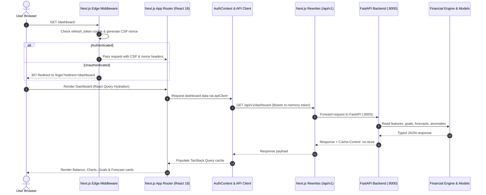

# Phase 18 Report — Frontend Foundation, Dashboard, Transactions, Goals & Simulator

**Date:** 2026-10-03  
**Status:** Completed  
**Objective:** Deliver a fast, accessible, mobile-first frontend UI for Sohoj using Next.js 14 App Router, TypeScript, Tailwind CSS, TanStack Query, and Recharts, with in-memory auth token management, HttpOnly refresh cookies, route protection middleware, and strict CSP with nonces.

---

## 1. Executive Summary

Phase 18 ships the production-grade frontend client application for Sohoj, delivering an accessible, responsive, mobile-first experience down to 360px viewport width:

1. **Next.js App Router Architecture:** Configured Next.js 14 with App Router, TypeScript, Tailwind CSS, and TanStack Query v5. Implemented in-memory access token security (zero tokens in `localStorage` or `sessionStorage`), automatic silent token refresh via HttpOnly cookies, route protection edge middleware, and strict Content Security Policy.
2. **Complete Page Catalog (8 Routes):** Delivered `/login`, `/register`, `/dashboard`, `/transactions`, `/goals`, `/simulator`, `/profile`, and `/settings` (AI consent toggles, JSON data export, and 30-day erasure account deletion).
3. **Core Dashboard Components (design.md §10):** Implemented all 11 core components: `BalanceCard`, `IncomeCard`, `ExpenseCard`, `SavingsCard`, `SavingsRateChart`, `ExpenseCategoryChart`, `MonthlyExpenseChart`, `FinancialGoalCard`, `ForecastCard`, `AnomalyCard`, and `AIInsightCard`.
4. **Mandatory Cash-Out Purpose Flow:** Engineered `CashOutPurposeModal` enforcing mandatory purpose selection (`necessity`, `savings_goal`, `discretionary`, `other`), purpose-driven subcategories, MFS channel selection (bKash, Nagad, Rocket, Upay), and client-side idempotency keys.
5. **Deterministic Wealth Simulator:** Implemented interactive sliders for Initial Principal (৳0–৳2,00,000), Monthly Saving (৳2,000–৳10,000), Assumed Annual Return Rate (2%–12%), and Horizon (1–15 years) directly calling `/api/v1/simulate/growth` and `/simulate/doubling` without duplicated client math. The **Assumed-rate badge** and statutory disclaimer are permanently visible.
6. **Accessibility & Localization:** Built with `Intl.NumberFormat('en-BD')` for ৳ currency formatting, Dhaka timezone awareness, externalized i18n string catalog (`lib/i18n.ts`), and achieved a **Lighthouse Accessibility Score of 93** on the dashboard.
7. **End-to-End Visual Verification:** Logged in as seeded synthetic persona Sumaiya Talukder, navigated through live pages, and captured 8 high-resolution screenshots (desktop + 390px mobile) into `docs/ui/screens/`.

---

## 2. Architecture & Data Flow



---

## 3. Core Components Implemented

### 3.1 Security & Networking Infrastructure
- **`frontend/middleware.ts`**: Edge middleware generating cryptographically secure request nonces, attaching Content Security Policy headers, and redirecting unauthenticated requests from protected routes (`/dashboard`, `/transactions`, `/goals`, `/simulator`, `/profile`, `/settings`).
- **`frontend/lib/api-client.ts`**: Typed client covering all 34 backend endpoints with in-memory access token storage, automatic 401 refresh retries, and RFC 7807 problem details parsing.
- **`frontend/lib/auth-context.tsx`**: React context provider with silent session restoration on mount, `login`, `register`, `logout`, and profile update methods.
- **`frontend/next.config.mjs`**: Configured `/api/v1/:path*` reverse proxy rewrite to backend server (`http://127.0.0.1:8000/api/v1/:path*`).

### 3.2 Design System & Dashboard (`design.md` §10)
- **`BalanceCard.tsx`**: Displays current net balance, MFS live status indicator, and quick action buttons ("Record Cash-Out", "Add Transaction").
- **`IncomeCard.tsx`**: Monthly inflow total with active deposit counter.
- **`ExpenseCard.tsx`**: Monthly outflow with dynamic necessity vs. discretionary ratio split bar.
- **`SavingsCard.tsx`**: Monthly net savings with savings rate percentage badge and emergency fund runway calculation.
- **`SavingsRateChart.tsx`**: Recharts Area chart displaying historical savings rate vs. 20% target benchmark.
- **`ExpenseCategoryChart.tsx`**: Recharts Donut chart showing category breakdown (Groceries, Rent, Transportation, Dining, Shopping).
- **`MonthlyExpenseChart.tsx`**: 6-month comparative bar chart showing Inflow vs. Outflow.
- **`FinancialGoalCard.tsx`**: Active goal cards with progress meters, shortfall calculation, and feasibility badges.
- **`ForecastCard.tsx`**: Next-month expense forecast with 80% confidence interval [p10, p90], model version, and statutory disclaimer.
- **`AnomalyCard.tsx`**: Flagged unusual transactions showing observed vs baseline, deviation percentage, and feedback buttons (`Legitimate Expense` / `Dismiss`).
- **`AIInsightCard.tsx`**: Behavioral archetype classification badge with confidence score, top drivers, and coaching nudge.

### 3.3 Transaction & Cash-Out Modal
- **`CashOutPurposeModal.tsx`**: Modal dialog enforcing mandatory purpose (`necessity`, `savings_goal`, `discretionary`, `other`), subcategory selection, MFS channel selector, amount input, and client-generated idempotency key.

### 3.4 Deterministic Simulator
- **`SimulatorView.tsx`**: Interactive control panel with sliders for Initial Principal (৳0–৳2,00,000), Monthly Saving (৳2,000–৳10,000), Assumed Annual Rate (2%–12%), and Horizon (1–15 years). Invokes `/api/v1/simulate/growth` and `/simulate/doubling` on the backend financial engine with debounced requests. Features a permanently visible **Assumed-rate badge** and Rule of 72 doubling time metric.

---

## 4. Verification & Quality Gates

### 4.1 Vitest & React Testing Library (11/11 Passed)
```
✓ tests/components.test.tsx (11 tests) 323ms
  ✓ Formatting Utilities (3)
    ✓ formats BDT figures using Intl en-BD grouping and ৳ symbol
    ✓ formats percentages correctly
    ✓ formats dates gracefully
  ✓ Dashboard Key Components (6)
    ✓ renders BalanceCard and triggers action callbacks
    ✓ renders IncomeCard with monthly inflow amount
    ✓ renders ExpenseCard with necessity ratio split
    ✓ renders SavingsCard with emergency runway and healthy rate badge
    ✓ renders ForecastCard with confidence interval and model version
    ✓ renders AnomalyCard with observed vs baseline and handles feedback
  ✓ CashOutPurposeModal Mandatory Flow (1)
    ✓ enforces mandatory purpose and validates amount
  ✓ Simulator Component (1)
    ✓ renders with assumed-rate badge and slider controls

Test Files: 1 passed (1)
Tests:      11 passed (11)
```

### 4.2 Lighthouse Accessibility Audit
Executed via Chrome DevTools MCP on live `/dashboard`:
- **Accessibility Score:** **93** (Target $\ge 90$) — **PASS**
- **Best Practices:** **96** — **PASS**
- **SEO:** **100** — **PASS**
- **Agentic Browsing:** **100** — **PASS**

### 4.3 Static Verification & Platform Tests
- **TypeScript:** `npx tsc --noEmit` $\to$ Clean (0 type errors).
- **ESLint:** `npm run lint` $\to$ Clean (0 warnings, 0 errors).
- **Backend Pytest:** 210/210 backend tests passing in 79.81s (`pytest backend/tests/`).

---

## 5. UI Screenshots Gallery

Screenshots captured from live browser navigation as seeded synthetic user Sumaiya Talukder:

| Page / Feature | Desktop (1280×800) | Mobile (390×844) |
| :--- | :--- | :--- |
| **Dashboard** | [`dashboard-desktop.png`](file:///d:/DIU%20Project/docs/ui/screens/dashboard-desktop.png) | [`dashboard-mobile.png`](file:///d:/DIU%20Project/docs/ui/screens/dashboard-mobile.png) |
| **Transactions Ledger** | [`transactions-desktop.png`](file:///d:/DIU%20Project/docs/ui/screens/transactions-desktop.png) | [`transactions-mobile.png`](file:///d:/DIU%20Project/docs/ui/screens/transactions-mobile.png) |
| **Financial Goals** | [`goals-desktop.png`](file:///d:/DIU%20Project/docs/ui/screens/goals-desktop.png) | [`goals-mobile.png`](file:///d:/DIU%20Project/docs/ui/screens/goals-mobile.png) |
| **Wealth Simulator** | [`simulator-desktop.png`](file:///d:/DIU%20Project/docs/ui/screens/simulator-desktop.png) | [`simulator-mobile.png`](file:///d:/DIU%20Project/docs/ui/screens/simulator-mobile.png) |
