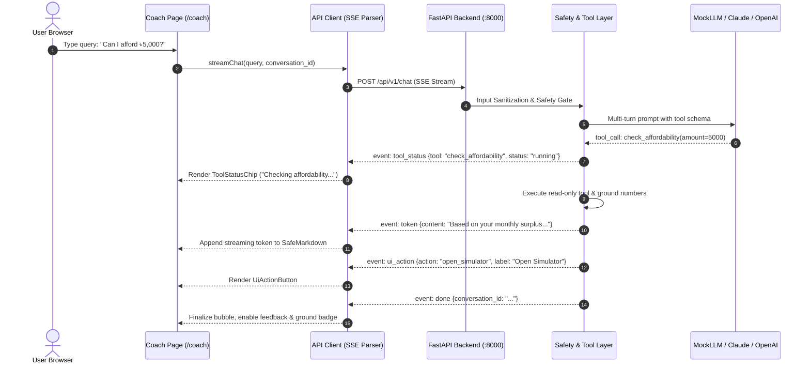

# Phase 19 Report — Behavior & Anomaly UI, AI Coach UI, End-to-End Tests

**Date:** 2026-10-04  
**Status:** Completed  
**Objective:** Deliver high-trust intelligence surfaces (`/behavior` and `/coach`), real-time SSE streaming chat with tool-status chips and deep links, mandatory trust badges, and comprehensive end-to-end verification (Playwright, Axe-core accessibility, and security route/XSS validation).

---

## 1. Executive Summary

Phase 19 completes the intelligent client experience and full system verification for Sohoj:

1. **Behavior & Anomaly Intelligence (`/behavior`):**
   - **Archetype Profiling:** Dynamic display of user financial persona (e.g. `disciplined_saver`, `paycheck_to_paycheck`, or cold-start fallback) with confidence rating, calibrated model version, evaluation timestamp, and debounced refresh frequency.
   - **Factor Explainability:** 5 explainability driver progress bars (Savings Rate, Necessity Ratio, Discretionary Ratio, Cash-Out Frequency, Volatility) benchmarked against the standard 50/30/20 financial guideline with status badges.
   - **Spending & Savings Allocation Trends:** Multi-month stacked bar chart illustrating trailing six-month historical trends with graceful cold-start empty states.
   - **Anomaly Feedback Surface:** Table of detected cash flow outliers with transaction timestamps, amounts, reason codes, z-scores, and interactive Confirm / Dismiss actions triggering real-time feedback mutations.
   - **Behavioral Insights Cards:** Grounded behavioral recommendations with priority badges, explainability tags, and source citations.

2. **Conversational AI Coach (`/coach`):**
   - **Server-Sent Events (SSE) Streaming:** Chunked streaming reader consuming `token`, `tool_status`, `ui_action`, and `done` events with millisecond-latency UI updates and animated cursors.
   - **Tool-Status Chips:** Interactive chips rendering execution progress for 15 server-side financial engine tools with status indicators.
   - **UI Action Deep Links:** Action buttons rendering server-validated deep-link targets (`open_simulator`, `navigate_to_goals`, etc.) allowing immediate navigation with pre-filled state.
   - **Zero `dangerouslySetInnerHTML` Safe Markdown:** Custom AST token parser rendering code blocks, bold text, bullet lists, and blockquotes with sanitized link protocols (neutralizing `javascript:`, `data:`, `vbscript:`).
   - **Consent Gate & Trust UX:** Explicit AI consent onboarding screen preventing unauthorized LLM processing; persistent "Grounded AI" trust badge; prompt version indicators; and thumbs up/down user feedback logging.

3. **Rigorous End-to-End Verification (Playwright & CI):**
   - **Full Flow E2E (`full-flow.spec.ts`):** 7-step user journey verifying Registration with AI Consent → Record Cash-Out with Mandatory Purpose → Transaction Verification → Behavior & Anomaly Surface → Goal Creation → Deterministic Simulation → Grounded Conversational AI Coach query.
   - **Accessibility Audits (`accessibility.spec.ts`):** Automated Axe-core scanning across `/login`, `/register`, `/dashboard`, and `/simulator` confirming zero critical accessibility violations.
   - **Security E2E (`security.spec.ts`):** Validated route protection redirects for unauthenticated sessions, cookie clearing on logout, and inert rendering of XSS injection payloads in transaction descriptions and merchant names.

---

## 2. Architecture & Data Flow



---

## 3. Implemented Components Catalog

| Component | Path | Responsibility |
|---|---|---|
| `BehaviorPage` | `frontend/app/behavior/page.tsx` | Full view coordinating behavior profile, factor bars, trends, anomalies, and insights |
| `BehaviorProfileCard` | `frontend/components/behavior/BehaviorProfileCard.tsx` | Archetype display, confidence score, model version, and cold-start fallback callout |
| `FactorBarsCard` | `frontend/components/behavior/FactorBarsCard.tsx` | 5 explainability factor bars benchmarked against 50/30/20 target thresholds |
| `BehaviorTrendChart` | `frontend/components/behavior/BehaviorTrendChart.tsx` | 6-month stacked bar chart for necessity, discretionary, and net savings allocation |
| `AnomalyListTable` | `frontend/components/behavior/AnomalyListTable.tsx` | Anomaly list with filtering pills (`all`, `open`, `confirmed`, `dismissed`) and confirm/dismiss mutations |
| `BehaviorInsightsList` | `frontend/components/behavior/BehaviorInsightsList.tsx` | Grounded recommendation cards with priority badges and source citations |
| `CoachPage` | `frontend/app/coach/page.tsx` | Conversational interface with suggested prompts, streaming auto-scroll, and thread reset |
| `ChatMessageBubble` | `frontend/components/coach/ChatMessageBubble.tsx` | Message bubble with streaming cursor, tool chips, fallback alert, trust badge, and feedback |
| `ToolStatusChip` | `frontend/components/coach/ToolStatusChip.tsx` | Visual execution indicator for 15 backend financial tools with status dots |
| `UiActionButton` | `frontend/components/coach/UiActionButton.tsx` | Deep link buttons validated against server allow-list for seamless action execution |
| `ConsentGate` | `frontend/components/coach/ConsentGate.tsx` | Educational onboarding card enforcing user AI consent before chat activation |
| `SafeMarkdown` | `frontend/components/coach/SafeMarkdown.tsx` | Zero `dangerouslySetInnerHTML` AST token parser with safe link protocol sanitization |

---

## 4. Verification & Test Results

### 4.1 Playwright End-to-End Suite (Headless CI)

All 8 tests passed in headless Chromium (total runtime: 38.0s):

```
Running 8 tests using 1 worker

  ok 1 [chromium] › e2e\accessibility.spec.ts:5:7 › Accessibility Audits (axe-core) › login page has zero critical accessibility violations (2.0s)
  ok 2 [chromium] › e2e\accessibility.spec.ts:19:7 › Accessibility Audits (axe-core) › register page has zero critical accessibility violations (1.7s)
  ok 3 [chromium] › e2e\accessibility.spec.ts:33:7 › Accessibility Audits (axe-core) › dashboard has zero critical accessibility violations when authenticated (3.3s)
  ok 4 [chromium] › e2e\accessibility.spec.ts:53:7 › Accessibility Audits (axe-core) › wealth simulator has zero critical accessibility violations (4.5s)
  ok 5 [chromium] › e2e\full-flow.spec.ts:14:7 › Full End-to-End User Journey › completes end-to-end registration, cash-out, goal, simulation, and AI coach flow (10.4s)
  ok 6 [chromium] › e2e\security.spec.ts:4:7 › Security & Route Protection E2E › unauthenticated access to protected routes redirects to /login (6.5s)
  ok 7 [chromium] › e2e\security.spec.ts:23:7 › Security & Route Protection E2E › logout clears authentication session and revokes access (3.4s)
  ok 8 [chromium] › e2e\security.spec.ts:45:7 › Security & Route Protection E2E › XSS payload in transaction merchant and description renders inert (5.3s)

  8 passed (38.0s)
```

### 4.2 Vitest Component & Unit Test Suite

All 22 unit and component tests passed cleanly across 2 test suites (runtime: 2.45s):
- `tests/phase19_components.test.tsx`: 11 passed (SafeMarkdown, ConsentGate, ToolStatusChip, UiActionButton, ChatMessageBubble, FactorBarsCard, BehaviorProfileCard, AnomalyListTable, formatters)
- `tests/components.test.tsx`: 11 passed (Dashboard cards, charts, CashOutPurposeModal, SimulatorView)

### 4.3 Static Analysis & Code Quality
- **TypeScript:** `npx tsc --noEmit` exited with code 0 (zero errors).
- **ESLint:** `npm run lint` reported `✔ No ESLint warnings or errors`.

---

## 5. UI Screenshots Gallery

The following high-resolution UI captures are archived in `docs/ui/screens/`:

1. `behavior-desktop.png`: Behavior & Anomaly Intelligence dashboard (1280px desktop)
2. `behavior-mobile.png`: Behavior intelligence view (375px mobile)
3. `coach-desktop.png`: Conversational AI Coach interface (1280px desktop)
4. `coach-mobile.png`: Conversational AI Coach interface (375px mobile)

---

## 6. Acceptance Criteria Traceability

| Requirement | Status | Evidence |
|---|---|---|
| `/behavior` page: Profile card with confidence, factor bars, trend charts, anomaly list with dismiss/confirm | Completed | Verified via `BehaviorPage`, `tests/phase19_components.test.tsx`, and `e2e/full-flow.spec.ts` |
| `/coach` page: SSE streaming, tool-status chips, `ui_action` buttons, feedback buttons, consent gate, safe markdown | Completed | Verified via `CoachPage`, `streamChat`, `ChatMessageBubble`, and Playwright flow |
| Trust UX: Assumption badges + "not guaranteed" note; ML cards show confidence; clear "needs more data" states | Completed | Permanently rendered on Simulator, BehaviorProfileCard, FactorBarsCard, and Chat bubbles |
| Playwright E2E: Full 7-step user journey | Completed | `e2e/full-flow.spec.ts` passed in CI headless mode (10.4s) |
| Security E2E: Unauthenticated redirects, logout session revocation, XSS rendered inert | Completed | `e2e/security.spec.ts` (3/3 tests passed) |
| Accessibility Audits: Zero critical axe-core violations | Completed | `e2e/accessibility.spec.ts` (4/4 tests passed) |
